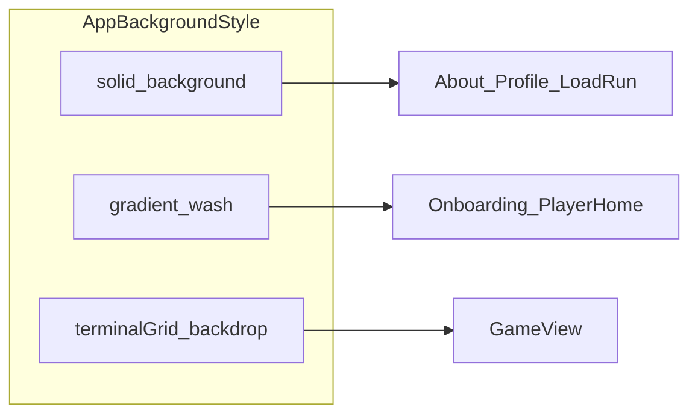

## Overview

**NanInf** reads as a fantasy terminal: every surface is typeset in **Monocraft**, and structure comes from **outline frames** (`drawBorder`) rather than cards with corner radius. The canvas alternates between **warm light** and **near-black** (`Color.background` from assets) while **accent** (also from assets) shifts from a vivid blue‑violet in light mode to electric green in dark mode—intentionally strong contrast per appearance.

Hub flows (onboarding, home) use **`AppBackgroundStyle.gradient`**—a restrained diagonal wash of accent and mana. The **live game** switches to **`AppBackgroundStyle.terminalGrid`**: `TerminalBackdrop` stacks a soft gradient with a **scanline grille** so the session feels like a CRT session without abandoning readability.

**Key characteristics:**

- **Monospace-only typography** scaled with **Dynamic Type** (`Font.monocraft(relativeTo:weight:)`).
- **Rectilinear chrome**; borders are the primary containment pattern.
- **Semantic terminal palette** (`terminalMana`, `terminalWarning`, `terminalDanger`, `terminalMutedText`) defined in Swift; **canvas + accent** from **Asset Catalog** color sets.
- **Motion vocabulary** centralized in `TerminalMotion` (cursor blink, loaders, panel transitions, quick press) with **reduce motion** respected.
- **Global layout** via `AppLayout`: background variant, inset padding, optional scroll, navigation bar suppressed for a self-contained terminal frame.

## Colors

> **Sources:** [`Assets.xcassets/Colors`](magoSanduiche/Assets.xcassets/Colors) for `background` and `accent`; [`DrawBorder.swift` `Color` extension](magoSanduiche/Extensions/DrawBorder.swift) for terminal semantics.

### Canvas

- **Background (`{colors.background}`)** — Light: `#fefcf0`. Dark: `#1e1e1e`. The base field behind all stacks; [`magoSanduicheApp`](magoSanduiche/magoSanduicheApp.swift) and coordinator use it at the root.

### Brand / interactive

- **Accent (`{colors.accent}` / `{colors.accent-dark}`)** — Light appearance uses **extended sRGB** approximately `#3033ee` (catalog red/green/blue components 0.187 / 0.200 / 0.935). Dark appearance: `#09ff00`. Used for primary labels, links, default `drawBorder` strokes, text fields, and hub gradient washes.
- Accent at **18% opacity** defines **`{colors.terminal-grid-line}`** (`Color.terminalGrid`).
- Two named muted-accent border tones live on `Color`: **`accentBorderIdle`** (accent @ 55%) for unfocused/idle frames and **`accentBorderActive`** (accent @ 80%) for focused/active frames or temporary status chips. Don't introduce new accent opacities for borders — extend these.

### Terminal surfaces

All terminal semantics ship as Asset Catalog colorsets with explicit light/dark appearances; the Swift `Color` extension just exposes friendly aliases.

- **`{colors.terminal-surface}`** — Light: `#1a2018` (warm-tinted near-black). Dark: `#050d19`. Used for panels, status strips, list wells.
- **`{colors.terminal-active-surface}`** — Light: `#222a23`. Dark: `#081712`. Used for focused `InputBox`, selected onboarding rows.

### Semantic accents

- **`{colors.terminal-mana}`** — Light: `#0a78a8` (deeper teal for ≥4.5:1 on cream). Dark: `#40c7ff`. Framing copy, mana-themed borders, secondary hub wash alongside accent.
- **`{colors.terminal-warning}`** — Light: `#a86c00` (warm amber). Dark: `#ffbf3d`. Loading dice / busy chrome, emphasis in prologue panels, DEBUG controls.
- **`{colors.terminal-danger}`** — Light: `#b22d2d` (brick red). Dark: `#f44040`. Error or danger callouts (e.g. media / vision error paths).

### Text

- **`{colors.terminal-muted-text}`** — Light: `#4a685c` (deepened teal-grey). Dark: `#6e8c80`. Secondary body, placeholders tone, subdued borders when disabled.

## Typography

### Font family

- **Monocraft** exclusively for UI (see [`Font.swift`](magoSanduiche/Public/Font.swift)). Sizes resolve from `UIFont.preferredFont(forTextStyle:)` on iOS so the app tracks **Dynamic Type**.

### Hierarchy

| Token | SwiftUI `TextStyle` | Typical Monocraft weight | Use |
| --- | --- | --- | --- |
| `{typography.large-title}` | `largeTitle` | bold / semibold | Rare display |
| `{typography.title}` | `title` … `title3` | bold | Screen titles, banner lines |
| `{typography.headline}` | `headline` | semibold | Buttons, prompts, `>` input prefix |
| `{typography.body}` | `body` | regular | `TextField`, narrative |
| `{typography.callout}` | `callout` | regular | Secondary blocks |
| `{typography.caption}` | `caption` / `caption2` | regular / semibold | Border titles, fine UI |

### Principles

- **Scale with the system** — Prefer `.monocraft(relativeTo:)` over fixed point sizes except asset / glyph tuning.
- **Weight over size** for emphasis within the same line (semibold headlines vs body).
- **Border labels** use caption Monocraft in the **same color as the stroke** for a diegetic panel title.

## Layout

### Screen template

- **`AppLayout`** ([`AppLayout.swift`](magoSanduiche/Shared/Views/AppLayout.swift)) wraps content in a `ZStack`: **background layer** + **padded content** (or `ScrollView` when `scrollable`).
- **Default insets:** `{spacing.layout-*}` as documented in YAML (16 / 20 / 24 / 20).
- **Navigation:** `.navigationBarBackButtonHidden(true)` and `.toolbar(.hidden, for: .navigationBar)` so each screen is self-framed; routing uses `NavigationStack` in [`AppCoordinatorView`](magoSanduiche/Navigation/AppCoordinatorView.swift).

### Content width

- Content uses `frame(maxWidth: .infinity, alignment: .top)` so terminal panels read full-bleed within safe area and padding.

## Elevation & depth

| Level | Treatment | Use |
| --- | --- | --- |
| Flat panels | Fill `{colors.terminal-surface}` / `{colors.background}` | Lists, modals, document screens |
| Soft wash | Low-opacity linear gradients (accent + mana) | Hub and `TerminalBackdrop` |
| Scanline layer | 80 × 1pt lines at 28% layer opacity | Session-only atmosphere |
| Glow | `shadow(color: accent.opacity(~0.28–0.35), radius: 10)` | Primary bordered buttons |
| CRT trace | `drawBorder(animate: true)` trims stroke with `crtRevealBorderProgress` | Onboarding / reveal sequences |

**Shadow philosophy:** Elevation is **functional and diegetic**—accent glow sells interactive bordered controls; the scanline stack suggests depth without skeuomorphic cards. There is **no** corner-radius card shadow language.

## Shapes

### Border radius

- **`{rounded.none}`** everywhere in current UI: **no** `RoundedRectangle` / `cornerRadius` pattern in app sources. Frames are **sharp rectangles**; the “component shape” is the **stroke** from `drawBorder`.

### Border geometry

- Optional **top gap** in the rectangle outline so a **caption label** can sit on the top edge (see [`DrawBorder.swift`](magoSanduiche/Extensions/DrawBorder.swift)).
- Default stroke **2pt**; controls may use **1pt** for lighter chrome (`InputBox` unfocused).

## Components

### App shell

- **`AppLayout`** — Parameters: `background` (`solid` | `gradient` | `terminalGrid`), `contentPadding`, `scrollable`. Maps to YAML `app-layout-*` variants.
- **`NavigationStack` + `AppRoute`** — Single stack; destinations swap feature roots; transitions use `TerminalMotion.panelTransition` where applied.

### Backdrop

- **`TerminalBackdrop`** — Implements `backdrop-terminal-session`: background color, diagonal gradient, then scanline `VStack` with `spacing: 7` and line height `1`.

### Chrome

- **`drawBorder`** — Public API on `View`; parameters `desc` (title), `color`, `lineWidth`, `animate`. Integrates with CRT reveal environment for staged draws.

### Buttons

- **`OnboardingPrimaryButtonStyle`** — Accent label + `drawBorder` + `scaleEffect(0.985)` + accent shadow; line width 2→3 when pressed.
- **`ContextualButton` + `TerminalButtonStyle`** — Full-width game actions; warning border and spinner when `isLoading`; same press / shadow pattern.

### Inputs

- **`InputBox`** — Implements `input-terminal`: `>` prefix (`headline` semibold), `TextField` (`body`), focus-driven fill and border title, shake on invalid attempts (motion-gated).

### Status & overlays

- Profile sections, terminal status strips, vision panels reuse **`{colors.terminal-surface}`** fills and **`drawBorder`** with mana or muted strokes—pattern matches YAML `draw-border-default` variants.

### DEBUG (development only)

- Bottom-trailing **`AppCoordinatorView`** overlay: warning-accent bordered chip on `terminalSurface` (see `#if DEBUG` block).

## Do's and Don'ts

### Do

- Use **`{colors.accent}`** for default interactive strokes and primary text on light/dark canvases per design intent.
- Use **`{colors.terminal-mana}`** for ethereal framing—section accents, mana borders, gradients—not for generic body text.
- Reserve **`{colors.terminal-warning}`** for **in-flight** states (rolling, loaders, deliberate emphasis).
- Wrap top-level screens in **`AppLayout`** with the **correct `AppBackgroundStyle`** for the narrative mode (hub vs session vs document).
- Route motion through **`TerminalMotion`** and honor **`accessibilityReduceMotion`**.
- Prefer **`drawBorder`** for new contained regions instead of introducing ad-hoc `Rectangle().stroke` copies.

### Don't

- Don’t introduce **rounded card** language without updating this document—corners are square by convention.
- Don’t replace **`terminalWarning`** as the loading color with **`accent`**—the codebase distinguishes busy vs ready.
- Don’t hard-code **fixed font sizes** for user-facing typography; use **`Font.monocraft(relativeTo:)`**.
- Don’t stack **multiple unrelated accent hues** on one control; the palette is deliberately small.

## Responsive behavior & platform notes

### Dynamic Type

- All Monocraft text tied to **`TextStyle`** grows and shrinks with system text settings; verify long strings in **`InputBox`** and onboarding **selection rows** at accessibility sizes.

### Light / Dark

- **All canvas, accent, and terminal-semantic colors** adapt via asset catalog luminosity appearances. The dark variants preserve the original CRT-flavored hues (`#40c7ff` mana, `#ffbf3d` warning, `#050d19` surfaces); the light variants are darkened/desaturated for ≥4.5:1 contrast on the `#fefcf0` cream background. The `Color` extension in [`DrawBorder.swift`](magoSanduiche/Extensions/DrawBorder.swift) is just a thin alias on top of the assets, so every call site picks up appearance changes automatically.

### Safe area & navigation

- Back navigation is **custom** per feature (not the system nav bar). Full-screen terminal layouts should still respect safe areas unless explicitly `ignoresSafeArea()` on background layers only (see `AppLayout` background vs content).

### Touch targets

- Buttons use generous vertical padding (**14pt** on `ContextualButton`); keep minimum **44pt** tall targets when adding controls.

## Iteration guide

1. **One component ↔ one YAML key** under `components:`; extend the table rather than nesting prose-only specs.
2. **Reference tokens** as `{colors.*}`, `{spacing.*}`, `{typography.*}` in new entries for agent and human readability.
3. When changing **Swift `Color` statics**, update **`colors:`** hex approximations in this file—Swift uses float RGB; YAML uses rounded `#rrggbb`.
4. When adding **appearance-specific accent behavior**, mirror entries in **`Assets.xcassets`** and summarize here (`accent`, `accent-dark`).
5. **Motion constants** (`TerminalMotion`) belong in prose + optional YAML extension if timers become formal tokens.
6. **Do not document every localized string**; link behavior to **semantic roles** (“border title”, “loader copy”) instead.

## Related architecture docs

Visual language only here. Cross-cutting product decisions (auth storage, model tools, payments/credits) are indexed from [`CONTEXT.md`](CONTEXT.md) and live in [`docs/adr/`](docs/adr/) — including the payments and token-spend plan ([`0003`](docs/adr/0003-payments-and-token-spend.md)). Any future credit-balance or purchase chrome should reuse existing terminal surfaces (`ProfileSection`, Home top strip, Game system `TerminalEntry`), not new card/hub patterns.

## Known gaps

- **No formal radius scale** beyond “none”; if rounded surfaces are introduced, add `{rounded.sm}` … tokens and migrate components.
- **Form validation affordances** beyond `InputBox` shake are not cataloged here.
- **Pixel icons** (`Assets.xcassets/PixelIcons`) are content assets; template tint follows **`accent`** or semantic colors at call sites, not enumerated per icon.
- **Vision / AI panels** vary copy and border titles by feature state; structure is repeating `terminalSurface` + `drawBorder`, not additional tokens.
- **`accentColor`** catalog includes an empty universal slot with explicit light/dark entries—effective colors are luminosity-specific; Xcode fallbacks rely on appearances.
