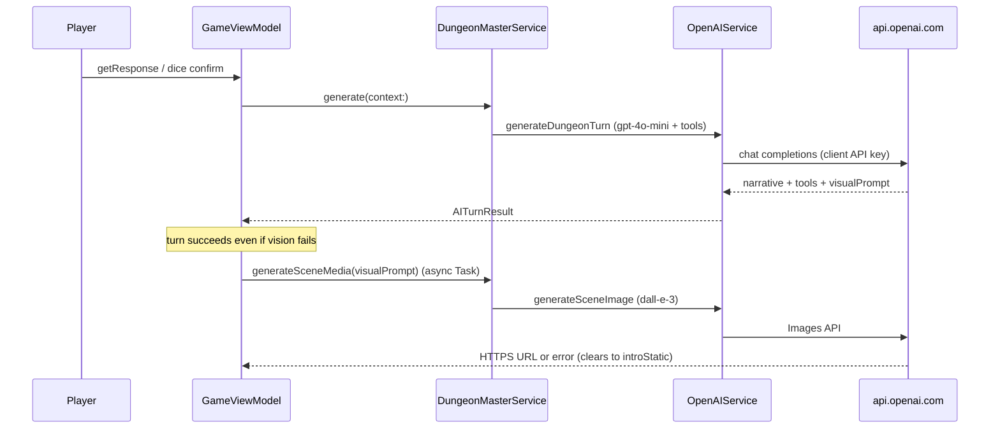

# 0003. Payments And Token Spend

## Status

**Accepted for implementation** — see [Implementation addendum](#implementation-addendum-revenuecat--supabase) and [`docs/revenuecat-setup.md`](../revenuecat-setup.md).

Originally proposed as planning-only; product code now ships RevenueCat + credits client + Supabase Edge Function sources.

## Branch basis

Inspected on **`main`** at `cdf71b2` (App Store–oriented `magoSanduiche` target, bundle `com.kyou.naninf`, marketing version `2.0`).

Other branches were checked and **not** used as source of truth:

| Branch | Why discarded |
| --- | --- |
| `free-tier` | Divergent **legacy `smorki`** tree (Firebase AI / Gemini era). No merge base with current `main`. Not NanInf free-tier product logic. |
| `feat/image-generation` | Same legacy `smorki` lineage; Gemini image experiments. |
| `feat/ux-v2`, `feat/pre-launch-v2`, `v2/magosanduiche` | Ancestors or behind `main`; product surface already landed on `main`. |

## Hypotheses corrected after reading the code

| Prior assumption | Actual on `main` |
| --- | --- |
| Client calls OpenAI + DALL·E for costly work | **Yes** for production paths. `DungeonMasterService` → `OpenAIService` with bundled `OPENAI_API_KEY`; scene art via `OpenAIService.generateSceneImage` (**DALL·E 3**, 1024). |
| `Services/ImageGeneration` is the live image path | **No.** `ImageGenerator` wraps **Apple ImagePlayground** and has **no call sites**. Live vision is `GameViewModel.handleVisionAfterTurn` → `DungeonMasterService.generateSceneMedia` → DALL·E URL → `VisionPanel` / `AsciiMediaView`. |
| Free-tier branch encodes free grants | **No.** Free play today is local flags: completing onboarding + sign-in sets `hasUnlockedFullGame` / `hasCompletedOnboarding`; there is **no credit ledger**. |
| StoreKit / IAP exists | **No** StoreKit imports or purchase code. Stale `nan_onboarding_paywall_*` strings (weekly sub copy) remain in `Localizable.xcstrings` with `extractionState: stale`. Active `OnboardingStep` ends at `.signIn`, not a paywall step. |
| Auth is missing | **Wrong in older docs** (`docs/current-ai-surface-map.md` is stale). Supabase Auth is live: `SupabaseAuthService`, `AuthSessionStore`, Apple/Google via `PlayerSignInPanel` / `AuthView`. Home/game gated by `canEnterHome` in `AppCoordinatorView`. |
| Docs already plan a backend | Partially: `docs/ai-feature-implementation-plan.md` already says production must proxy the OpenAI key and enforce entitlements. This ADR makes that the spend boundary. |

## Context — costly call sites today



Relevant types and files:

- **DM turn:** `GameViewModel+DungeonMasterTurn.beginDungeonMasterTurn` / `fetchNarrative` → `DungeonMasterService.generate` → `OpenAIService.generate` (model `.gpt4_o_mini`, tools `DecideAction` / `ChangeHealth` / `ChangeMana`).
- **Provider tokens (analytics only):** `OpenAIService` accumulates `promptTokens` / `completionTokens` into PostHog via `AppAnalytics` (`$ai_input_tokens`, `$ai_output_tokens`, `total_tokens`). Not a balance.
- **Scene image:** optional follow-up; empty/`nil` `PromptOutput.visualPrompt` skips generation; failures call `clearPostIntroVisionMedia()` and do **not** fail the turn.
- **Auth identity:** Supabase `user.id` after onboarding (`AuthLoginSnapshot.userID`). Required before `PlayerHomeView`.
- **“Unlock” today:** `OnboardingView.handlePrimaryAction` on final `.signIn` step sets local unlock flags — **not** a purchase.

There is **no** in-repo Supabase schema, Edge Functions, or receipt validation. Secrets: `OPENAI_API_KEY` in `Info.plist`; `SUPABASE_URL` / `SUPABASE_PUBLISHABLE_KEY` via build settings.

---

## Decision summary (recommended v1)

1. **Unit of spend:** player-facing **Credits** (integer), not raw OpenAI tokens.
2. **Ledger:** **server-authoritative** on Supabase (balance + append-only ledger), keyed by Supabase `user_id`.
3. **Generation path:** move both DM chat and DALL·E behind an **authenticated Supabase Edge Function (or equivalent proxy)** that holds the provider secret, checks balance, and meters spend. Client stops shipping `OPENAI_API_KEY`.
4. **Monetization:** **Apple IAP consumable credit packs** for v1; keep the door open for a later subscription that grants a monthly credit stipend. Do **not** ship external web checkout for digital credits inside the iOS app.
5. **Free tier:** one-time **starter credit grant** on first authenticated account (idempotent), sized so a new player can finish onboarding demo mindset and play a short first run without paying.
6. **Image policy:** scene generation remains **optional soft-fail**; charge image credits **only on provider success**. Prefer **hold → finalize/release** for DM turns so mid-turn failures do not strand the player.

---

## 1. Unit of spend and cost mapping

### Player-facing unit: Credits

Show **Credits** in UI (Profile / soft gate copy). Do not expose “input tokens” to players — they already fluctuate with tool loops (up to 20 iterations in `OpenAIService.runAgentLoop`) and history length.

### Internal metering (server)

| Meter | Trigger in app | Suggested credit cost (v1 sketch) | Provider reality (approx.) |
| --- | --- | --- | --- |
| `dm_turn` | Successful completion of `DungeonMasterService.generate` / proxy equivalent | **1 credit** | `gpt-4o-mini` chat + tool loops; usage already logged as `input_tokens` / `output_tokens` |
| `scene_image` | Successful `generateSceneImage` / proxy | **3 credits** | DALL·E 3 standard 1024 — materially more expensive per call than a mini turn |

**Why not 1:1 OpenAI tokens?** Tool loops and growing `conversationHistory` make per-token UX confusing; fixed per-action prices are easier to explain next to `ContextualButton` / vision tips. Server should still **log provider usage** (reuse analytics fields) to tune the credit→USD margin later.

**Dice confirmation turns** (`DungeonMasterTurnKind.diceResultConfirmation`) are still full DM generations — charge **`dm_turn`** the same as player text. Do not invent a free “dice only” path unless Enzo wants that product exception.

**ImagePlayground** (`Services/ImageGeneration/ImageGenerator.swift`): if ever wired as a free/on-device fallback, it should be a separate product decision (no OpenAI cost, different quality). **v1 plan assumes DALL·E remains the paid scene path.**

### Sketch margin note (not a forecast)

Assume rough ballpark COGS: mini turn often cents or less; DALL·E 3 often several cents. A pack priced so average session (say 8 turns + 3 images ≈ 8 + 9 = 17 credits) stays inside a small consumable is enough for v1 packaging — refine with live PostHog `$ai_*` + image event rates (`vision_scene_generate_*`).

---

## 2. Where the ledger lives (and why)

### Decision: server ledger only

| Store | Role |
| --- | --- |
| Supabase Postgres `credit_balances` | Current balance per `user_id` |
| Supabase Postgres `credit_ledger` | Append-only rows: grant, purchase, hold, capture, release, refund, adjust |
| iOS client | **Cache for display only** (Profile / Game soft gate). Never trust for authorize |

### Why not client-only

| Abuse / failure mode | Client ledger | Server ledger + proxy |
| --- | --- | --- |
| Replay purchased “grants” | Trivial | Blocked by `original_transaction_id` / `transaction_id` uniqueness |
| Clock / offline fake balance | Trivial | Balance checked at request time |
| Jailbreak / IPA extract of `OPENAI_API_KEY` | **Already possible today** — unlimited provider spend | Key removed from client; proxy requires Supabase JWT |
| Shared / leaked API key | Single key = shared pool | Per-user quota + rate limits |
| Tampered `hasUnlockedFullGame` | Already local-only | Unlock ≠ credits; spend enforced server-side |

`hasUnlockedFullGame` should be demoted over time to “finished onboarding UX,” not “paid entitlement.” Entitlement = **server balance + valid IAP history**.

### Suggested schema (sketch)

```text
credit_balances(user_id pk, balance int not null, updated_at)
credit_ledger(
  id, user_id, kind, amount,    -- amount signed; holds negative pending
  idempotency_key unique,
  apple_transaction_id null unique,
  generation_id null,           -- ties to dm_turn / scene_image job
  metadata jsonb, created_at
)
generation_jobs(
  id, user_id, kind, status,    -- held | succeeded | failed | released
  hold_ledger_id, credit_cost,
  created_at, finished_at
)
```

All mutations go through Edge Functions with the service role; clients use anon key + user JWT only.

---

## 3. Apple IAP vs other options

NanInf is a **live App Store iPhone app** (`com.kyou.naninf`, App Store ID **6749869965**). Digital credits that unlock AI generation are **digital goods** → **Apple IAP is required** for in-app purchase of those credits.

| Option | Fit |
| --- | --- |
| **Consumable credit packs (v1)** | Matches metered AI COGS; aligns with “spend per turn / image.” Restore = re-deliver unfinished transactions via StoreKit 2 + server reconcile, not “non-consumable unlock.” |
| **Auto-renewable subscription** | Stale copy (`nan_onboarding_paywall_price`: “3 days free, then $4.99/week”) assumed **unlimited turns**. That fights variable image+tool COGS unless the sub grants a **monthly credit stipend** + overage packs. Defer to v1.5+. |
| **Non-consumable “full game unlock”** | Bad fit once generation has ongoing cost; would require hard caps anyway. |
| **Web / Stripe checkout inside iOS app** | Avoid for digital credits (App Store guidelines). Reader-style external links are a later legal/product call for Enzo — not v1. |
| **Ads / rewarded video** | Possible free-credit faucet later; out of scope for v1 architecture. |

**Recommended commercial shape:** **hybrid later**, **consumables first**.

---

## 4. Free tier / first-session grant

### Current behavior to preserve in spirit

Players already reach a real session after onboarding demo + Supabase sign-in without paying. Keep that funnel.

### Proposed grant

- **When:** first time a Supabase user is created / first `ensure_player_wallet` call after auth (from `AuthSessionStore` signed-in path or first Game enter).
- **What:** e.g. **20 credits** (sketch: ≈ 11 text-only turns, or ≈ 5 turns + 5 images, or mix). Enough for a first run; not enough for unlimited play.
- **Idempotency:** ledger kind `starter_grant` with `idempotency_key = starter_grant:{user_id}` so reinstall / re-login cannot farm.
- **Device farming:** optional later — App Attest / device hash soft-cap. v1 accepts account-level grant only; monitor multi-account abuse.

### What not to do

- Do not keep “unlimited” language from stale paywall strings.
- Do not gate **Home** behind purchase; gate **generation** when balance < cost.
- Onboarding `.demo` can stay local / stubbed; paid metering starts when `DungeonMasterService` would hit the provider (live `GameView`).

---

## 5. Server-side enforcement

### Purchase → credit

1. Client StoreKit 2 `Product.purchase()` for a consumable.
2. App sends JWS transaction (or transaction id) + Supabase JWT to `POST /functions/v1/iap_credit`.
3. Function verifies with Apple (App Store Server API / signed transaction verification).
4. Insert ledger `purchase` with **unique** `apple_transaction_id`; increment balance.
5. Return new balance. Retries are safe (idempotent).

### Generate → deduct

**Preferred: hold / capture**

1. `POST /dm_turn` or `/scene_image` with JWT + client `idempotency_key` (use existing `turnID` UUID from `beginDungeonMasterTurn`).
2. Server checks `balance >= cost`, inserts `hold` row, creates `generation_jobs` status `held`.
3. Server calls OpenAI with **server** secret (same prompts/tools contract as today’s `DungeonMasterService` / `OpenAIService`).
4. On success: `capture` hold (net charge), return payload to client.
5. On failure / timeout: `release` hold; client shows existing `nan_dm_error` / clears vision.

**Deduct-on-success without holds** is acceptable for v1 images (already soft-fail) but riskier for DM turns if the client crashes after success and retries — prefer idempotent `turnID`.

### Refunds / revoke

- App Store refund notifications (Server Notifications V2) → ledger `refund` / negative adjust; clamp balance at 0; optional flag `purchases_revoked`.
- Support tooling: manual `adjust` with reason (Enzo / admin only).

### Restore

- Consumables: StoreKit 2 `Transaction.currentEntitlements` / unfinished transactions → re-run `iap_credit` idempotently.
- UI: attach **Restore** to **Profile** (and any future paywall sheet). Stale string `nan_onboarding_paywall_restore` can be reused when a sheet exists.
- Starter grant is **not** an IAP restore path.

### Rate limits

Per-user RPM on proxy + global provider budget alarms. Complements credits (stops burst even with large balance).

---

## 6. Mid-turn failure and optional images

| Scenario | Player outcome | Credits |
| --- | --- | --- |
| DM proxy fails before provider success | Existing system line `nan_dm_error`; stay playable | Hold **released** — no net charge |
| DM succeeds, client dies before render | On relaunch, job idempotent by `turnID`; if already captured, return stored result or treat as spent turn | No double charge |
| DM succeeds, `visualPrompt` empty | Narrative only; intro/static vision | `dm_turn` only |
| DM succeeds, image fails | Current behavior: `clearPostIntroVisionMedia()` | **No** `scene_image` charge |
| Balance ≥ turn cost but &lt; turn+image | Run DM; skip or soft-skip image with muted vision / tip | Charge turn only |
| Balance &lt; turn cost | Block submit before `beginDungeonMasterTurn`; show terminal-style insufficient copy; CTA to Profile packs | No call |

Wire the balance check at:

- `GameViewModel.getResponse` / dice confirm path (before `beginDungeonMasterTurn`)
- Optionally `handleVisionAfterTurn` (if balance &lt; image cost, skip generation without error spam)

Do **not** invent new merchant/hub screens for v1.

---

## 7. Product IDs, price sketch, phased ship

### Suggested product IDs (App Store Connect)

Prefix with bundle-style id:

| Product ID | Type | Credits granted (sketch) | Price sketch (USD) |
| --- | --- | --- | --- |
| `com.kyou.naninf.credits.starter_40` | Consumable | 40 | $4.99 |
| `com.kyou.naninf.credits.plus_100` | Consumable | 100 | $9.99 |
| `com.kyou.naninf.credits.vault_250` | Consumable | 250 | $19.99 |

Optional later:

| Product ID | Type | Sketch |
| --- | --- | --- |
| `com.kyou.naninf.sub.scribe_monthly` | Auto-renewable | Grants **120 credits / period** + small stackable packs; **not** unlimited |

**Price/pack numbers are a sketch only** — tune after measuring real `$ai_*` and `vision_scene_generate_*` rates on `main`.

### UI attachment points (existing surfaces only)

| Surface | Role |
| --- | --- |
| `ProfileView` | Show credit balance row; Buy packs; Restore Purchases; link to terms |
| `PlayerHomeView` top strip (`MAGO-DOS // session ready`) | Optional compact balance readout (same terminal chrome) |
| `GameView` / `InlineResponseStatusRow` / system `TerminalEntry` | Insufficient-credits message when submit blocked |
| `OnboardingView` | Keep auth-final; **do not** resurrect unlimited weekly paywall as the unlock. If a soft “you have N free credits” line is needed, put it after sign-in or on first Home — not a fake new hub |
| `AboutView` | Legal / support links only (existing credits panel is about-screen chrome, not wallet) |

### Phased ship plan

**Phase 0 — Proxy + ledger (hard prerequisite)**  
- Supabase tables + `dm_turn` / `scene_image` Edge Functions.  
- Remove production dependence on client `OPENAI_API_KEY` (keep DEBUG stub in `OpenAIService`).  
- Port request shaping from `DungeonMasterTurnFormatter` + tool adapters so behavior matches today’s client loop.  
- Starter grant on auth.  
- Client: `DungeonMasterService` talks to proxy with Supabase session instead of MacPaw OpenAI directly.

**Phase 1 — Metered free play (smallest safe product)**  
- Enforce holds/charges.  
- Soft-gate Game submit; Profile shows balance.  
- No IAP yet if needed for internal TestFlight cost control — still ship ledger.

**Phase 2 — IAP consumables**  
- StoreKit 2 products above.  
- `iap_credit` verification + Profile purchase UI + Restore.  
- Replace stale “unlimited / $4.99/week” copy.

**Phase 3 — Hardening**  
- ASSN refunds, richer receipts, anomaly alerts, optional App Attest.  
- Tune credit costs from production margins.  
- Decide subscription stipend vs packs-only.

**Phase 4 — Optional product extras**  
- ImagePlayground free fallback toggle.  
- Credit gifts / seasonal grants.  
- Separate “image off” setting to stretch free credits (product, not architecture).

---

## 8. What would change in this codebase (when implementing later)

Planning reference only — **do not implement in this PR.**

| Area | Change |
| --- | --- |
| `DungeonMasterService` / `DungeonMasterModelClient` | Implementations call authenticated proxy; keep method shapes (`generate`, `generateSceneMedia`) so `GameViewModel` stays stable |
| `OpenAIService` | Dev/DEBUG direct path only; production provider secret leaves the app |
| `Info.plist` `OPENAI_API_KEY` | Remove from Release; fail closed if proxy misconfigured |
| `AuthSessionStore` | After signed-in, `ensureWallet()` / refresh balance |
| `GameViewModel+DungeonMasterTurn` | Preflight credit check; pass `turnID` as idempotency key |
| `GameViewModel+Vision` | Skip image when underfunded; never fail the narrative path |
| `ProfileView` | Balance + purchase + restore rows in existing `ProfileSection` pattern |
| `AppAnalytics` | Add `credits_balance`, `credit_charge_kind`, `iap_product_id` alongside existing AI events |
| New (later) | `Services/Payments/StoreKitCreditPurchasing.swift`, `Services/Credits/CreditBalanceStore.swift` — not present today |
| Docs debt | Refresh `docs/current-ai-surface-map.md` (still claims no Supabase/auth/StoreKit reality mismatch) in a separate PR |

---

## 9. Open questions (Enzo only)

1. **Target margin / willingness to pay** in BR vs US — confirm or replace the $4.99 / $9.99 / $19.99 sketch and starter **20** credits.
2. **Subscription appetite:** keep packs-only, or prioritize monthly stipend (replacing stale weekly-unlimited copy)?
3. **Must scene art stay DALL·E-paid**, or is ImagePlayground / “text-only vision” acceptable as default free path?
4. **Account sharing:** one balance per Supabase user is assumed — any household / Family Sharing requirements?
5. **Refund UX:** pause generation when balance hits 0 after Apple refund, or allow small negative grace?
6. **Where is Supabase project infra owned** (repo vs separate backend)? This app repo has **no** `supabase/` directory today.
7. **Compliance copy:** privacy policy / ToS URLs for AI spend + IAP — where do they live relative to `AboutView`?
8. **Demo vs live AI in onboarding:** should `.demo` ever call the paid proxy, or stay fully local forever?
9. **App Attest / anti-farm** priority for starter grants before public IAP?
10. **Product naming:** keep player term **Credits**, or lean into in-world mana metaphor (careful: game **MP** already uses `changeMana`)?

---

## Consequences

- Payments and spend become a **backend + IAP** problem; the SwiftUI app remains a client of `DungeonMasterService`-shaped APIs plus a thin credit store.
- Local flags like `hasUnlockedFullGame` stop meaning “paid.”
- Moving the OpenAI key server-side is **non-optional** for any honest ledger; otherwise jailbreaks bypass metering and bill the project directly.
- Stale onboarding paywall strings should be rewritten when Phase 2 lands so they do not promise unlimited weekly AI.

## References

- `docs/adr/0001-store-auth-tokens-in-keychain.md` — Supabase session secrecy
- `docs/adr/0002-use-typed-model-tools-with-provider-adapters.md` — tool contracts to preserve across proxying
- `docs/ai-feature-implementation-plan.md` — existing note to proxy provider secrets / entitlements
- `magoSanduiche/Services/AI/DungeonMasterService.swift`
- `magoSanduiche/Services/AI/OpenAIService.swift`
- `magoSanduiche/Features/Game/ViewModel/GameViewModel+DungeonMasterTurn.swift`
- `magoSanduiche/Features/Game/ViewModel/GameViewModel+Vision.swift`
- `magoSanduiche/Services/Auth/*`
- `magoSanduiche/Navigation/AppCoordinatorView.swift`
- `magoSanduiche/Features/Profile/ProfileView.swift`
- `magoSanduiche/Features/Home/PlayerHomeView.swift`

---

## Implementation addendum (RevenueCat + Supabase)

**Decision change vs original ADR §3:** IAP goes through **RevenueCat** (`RevenueCat` SPM `purchases-ios-spm` 5.85.0), not raw StoreKit. No Stripe / second billing vendor.

**Shipped in app**

| Piece | Location |
| --- | --- |
| Credit costs / product IDs | `Services/Credits/CreditCatalog.swift` |
| Ledger HTTP contract | `Services/Credits/CreditsAPIClient.swift` |
| Wallet + purchase UI state | `Services/Credits/CreditWalletStore.swift` |
| RevenueCat wrapper | `Services/Payments/RevenueCatPurchasing.swift` |
| Profile buy / restore / balance | `Features/Profile/Subviews/ProfileCreditsSection.swift` |
| DM hold/capture + image charge-on-success | `GameViewModel+DungeonMasterTurn` / `+Vision` |
| Auth identify | `Purchases.logIn(supabaseUserId)` from `magoSanduicheApp` after `AuthSessionStore` session |
| Config placeholder | `REVENUECAT_API_KEY` in Info.plist / Build Settings; `Config/Secrets.xcconfig.example` |

**Shipped as deployable backend source (not auto-deployed from CI here)**

- `supabase/migrations/20260825180000_credits_ledger.sql`
- `supabase/functions/credits-wallet`, `credits-meter`, `revenuecat-webhook`

**Explicitly not done**

- OpenAI generation proxy / removal of client `OPENAI_API_KEY` — metering Edge Functions do not hold the provider secret yet. Until `credits-*` are deployed, the client **fail-opens** (no local ledger writes). Until a proxy exists, extracted API keys can still bypass spend.

Operator checklist: [`docs/revenuecat-setup.md`](../revenuecat-setup.md).
