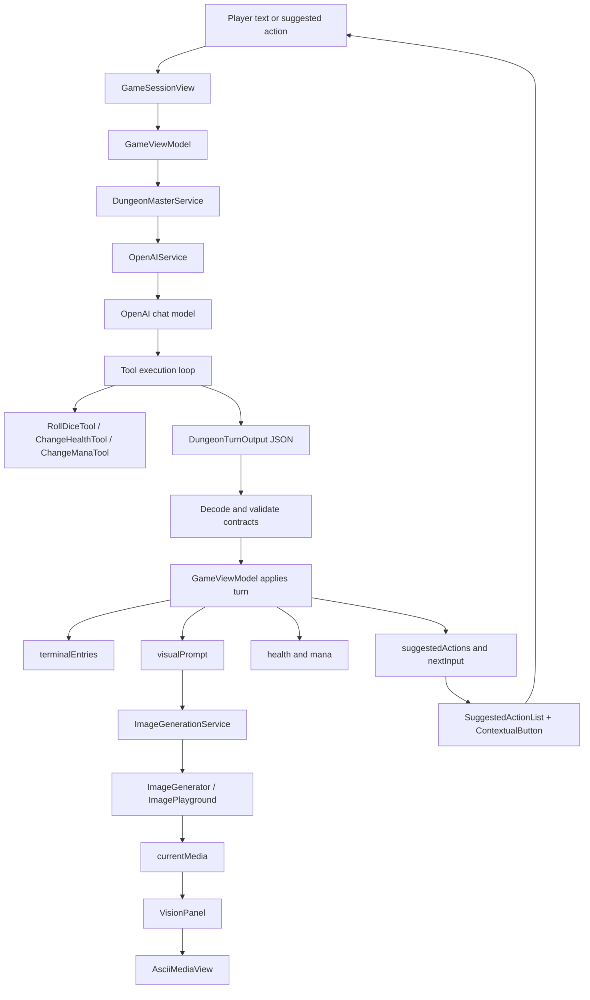
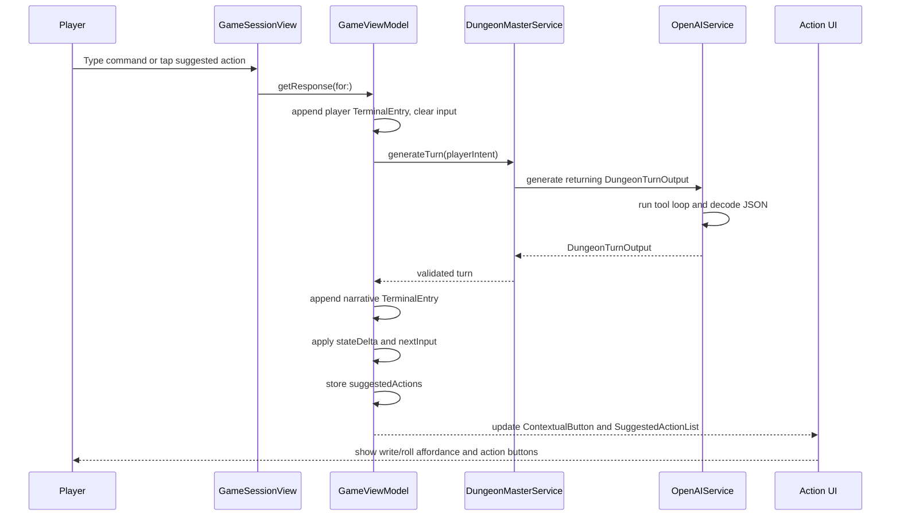
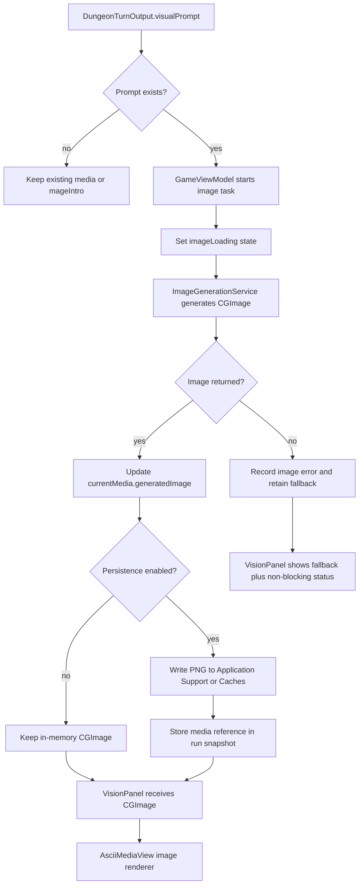

# AI Feature Implementation Plan

This plan describes how to bring the AI story, prompt, image, and suggested-action behavior from the old `magoSanduicheOld` app into the current `magoSanduiche` SwiftUI app without duplicating the old architecture. It builds on the existing maps in `docs/old-ai-functionality-map.md` and `docs/current-ai-surface-map.md`, plus the current app files inspected under `magoSanduiche/Services`, `magoSanduiche/Features/Game`, `magoSanduiche/Models/Game`, and `magoSanduiche/Resources/Prompts`.

## Executive Summary

The target behavior is a turn-based solo dungeon master loop:

1. The player types a command or taps one of the AI-suggested action buttons.
2. The app sends that player intent, plus conversation history, through `DungeonMasterService` and `OpenAIService`.
3. The model returns a structured turn result containing narrative text, next UI input mode, suggested actions, optional state changes, and an optional visual prompt.
4. `GameViewModel` appends the narrative to the terminal transcript, applies state changes, stores suggested actions as first-class state, and updates the contextual input or dice UI.
5. If the turn includes a visual prompt, the image service generates an image, stores it in the current media state, and `VisionPanel` renders it through `AsciiMediaView`.
6. Loading and failure states are tracked per stage so story text can succeed even if image generation fails.

The current app already has structured output decoding, tool execution, action presentation, `ImagePlayground` generation, and a robust ASCII media renderer. The work should pair old capabilities with those current surfaces.
The implementation should abstract the AI service to a service that comunicates to the provider, the service exposing the functions to call the llm, provided through a store, configuring the type of provider, for now being limited to only openAi and firebase / gemini

## Source References

Primary planning inputs:

- `docs/old-ai-functionality-map.md`: old app AI provider, prompts, text generation, image generation, plain-text action parsing, ASCII media, and reliability concerns.
- `docs/current-ai-surface-map.md`: current app AI provider, structured output, tools, game UI, image/media surfaces, persistence gaps, and attachment points.

Important current app files:

- `magoSanduiche/Services/AI/OpenAIService.swift`
- `magoSanduiche/Services/AI/DungeonMasterService.swift`
- `magoSanduiche/Resources/Prompts/PromptOutput.swift`
- `magoSanduiche/Resources/Prompts/Prompts.swift`
- `magoSanduiche/Public/Prompts/system_prompt.md`
- `magoSanduiche/Services/AI/Tools/RollDice.swift`
- `magoSanduiche/Services/AI/Tools/DecideAction.swift`
- `magoSanduiche/Services/AI/Tools/ChangeHealth.swift`
- `magoSanduiche/Services/ImageGeneration/ImageGenerator.swift`
- `magoSanduiche/Features/Game/GameViewModel.swift`
- `magoSanduiche/Features/Game/GameView.swift`
- `magoSanduiche/Features/Game/Components/ContextualButton.swift`
- `magoSanduiche/Features/Game/Components/ActionStack.swift`
- `magoSanduiche/Features/Game/Subviews/VisionPanel.swift`
- `magoSanduiche/Shared/Views/AsciiMediaView.swift`
- `magoSanduiche/Navigation/AppCoordinator.swift`
- `magoSanduiche/Models/Game/GameAction.swift`
- `magoSanduiche/Models/Game/TerminalEntry.swift`
- `magoSanduiche/Features/Home/LoadRunView.swift`

## Feature Parity Matrix

| Old app capability | Current app support | Proposed implementation location |
| --- | --- | --- |
| Solo dungeon master persona with persistent world memory | `Prompts.systemPrompt` defines a DM persona; `OpenAIService.conversationHistory` keeps in-memory chat history | Consolidate prompt contract in `magoSanduiche/Resources/Prompts/Prompts.swift`; optionally make `magoSanduiche/Public/Prompts/system_prompt.md` the canonical editable asset. Keep memory in `OpenAIService`, then add restoration support when persistence lands. |
| Main story generation call | `GameViewModel.fetchNarrative(for:)` calls `DungeonMasterService.generate(_:)`, which calls `OpenAIService.generate(_:returning:tools:model:)` | Rename or wrap as `DungeonMasterService.generateTurn(_:) -> DungeonTurnOutput`; update `GameViewModel.fetchNarrative(for:)` to apply the full structured turn rather than only `result.narrative`. |
| Old story responses ended with `What do you do?` plus `A/B/C` suggestions | `PromptOutput.options` already decodes an array, but `GameViewModel` drops it and the UI does not render it | Replace plain-text parsing with typed `SuggestedAction` values in `PromptOutput` or a new `DungeonTurnOutput`; render in a new `SuggestedActionList` under `ActionStack`; tap submits `SuggestedAction.prompt`. |
| Old `ActionModal` rendered multiple AI suggestions as buttons | Current `ContextualButton` renders one primary action: `.write` or `.roll`; `ActionStack` hosts the game action area | Keep `ContextualButton` for primary write/roll action. Add secondary suggested-action buttons in `GameView.terminalPanel` or `ActionStack` using `GameViewModel.suggestedActions`. |
| Old image-prompt generator transformed story plus user input into image JSON text | Current model output has no image prompt field; current `ImageGenerator` has a fixed concept string | Add `visualPrompt` to the structured turn result, or introduce `ImagePromptService` if image prompting should remain a second AI call. Start with one structured `visualPrompt` field to minimize latency and complexity. |
| Old Gemini image generation returned inline image data | `ImageGenerator` wraps Apple `ImagePlayground` and returns `[CGImage]?`, but is not connected to the visible UI | Add `ImageGenerator.generateImage(for prompt: VisualPrompt)` or recreate `ImageGenerator(concept:)` per request in `GameViewModel`. Store result in `GameViewModel.currentMedia`/`selectedImage`. |
| Old generated media was converted to ASCII | `AsciiMediaView` already supports `CGImage`, `UIImage`, local/remote image URLs, and videos | Change `VisionPanel` to accept an optional generated image/media source and render `AsciiMediaView(image:)` when present, falling back to `AsciiMediaView(catalogVideoNamed: "mageIntro")`. |
| Old app used a hardcoded remote MP4 fallback if image generation failed | Current `VisionPanel` always shows bundled `mageIntro`; `ImageGenerator` returns `nil` on failure | Use bundled `mageIntro` as the visual fallback. Surface a non-blocking "vision unavailable" status instead of inserting broken remote URLs. |
| Old AI selected next action by text options; current AI can call `decideAction` | `DecideActionTool` updates `GameViewModel.handleAction(_:)` through a static callback | Prefer structured `nextInput` in the turn result. Keep `DecideActionTool` only as a transitional compatibility tool or convert it to return data without mutating global state. |
| Old app had unused video/Fal remnants and negative prompt | Current app has no Fal dependency and no video generation provider | Do not port unused Fal/video code. If negative prompting is needed later, attach it to a provider-specific image request type, not the game model contract. |
| Old health/mana mechanics were prompt-level expectations | `ChangeHealthTool` exists but is not wired; `GameViewModel` has `health` and `mana`; no mana tool exists | Wire `ChangeHealthTool` or replace side effects with structured `stateDelta.health`. Add `ChangeManaTool` or `stateDelta.mana`. Clamp in `GameViewModel`. |
| Old run state was in memory only | Current run state is also in memory; `LoadRunView` is an empty state | Add `GameRunSnapshot`, `GameRunStore`, and make `TerminalEntry` codable. Implement persistence after core turn behavior is stable. |
| Old app logged Firebase Analytics events | Current app has no analytics/logging service | Add lightweight `Logger`/`OSLog` or a small `GameEventLogger` first. Avoid logging full prompts, transcripts, or API keys. Add product analytics later only with privacy review. |
| Old reset cleared visible history but not AI chat history | Current `DungeonMasterService.clearHistory()` exists but game reset/back navigation does not call it | Add `GameViewModel.resetRun()` and call `dungeonMaster.clearHistory()`, reset transcript/actions/media/state, and reset `AppCoordinator` presentation. |

## Target Architecture



## Runtime Flow: Prompt To Actions To UI State



## Runtime Flow: Image Generation To Media UI



## Proposed Data Contracts

The current `PromptOutput` can be evolved, but a new name makes the contract clearer and avoids treating old compatibility decoding as the final API. The examples below are planning examples, not source edits.

```swift
struct DungeonTurnOutput: StructuredOutput, Sendable {
    var narrative: String
    var toolResults: [ToolResult]
    var options: [SuggestedAction]
    var nextInput: NextPlayerInput
    var visualPrompt: VisualPrompt?
    var stateDelta: GameStateDelta?
}

struct SuggestedAction: Codable, Hashable, Identifiable, Sendable {
    var id: String
    var label: String
    var prompt: String
    var tone: SuggestedActionTone
}

enum SuggestedActionTone: String, Codable, Sendable {
    case aggressive
    case stealth
    case insight
    case defensive
    case utility
}

enum NextPlayerInput: String, Codable, Sendable {
    case freeText
    case diceRoll
}

struct VisualPrompt: Codable, Hashable, Sendable {
    var subject: String
    var setting: String
    var action: String
    var mood: String
    var composition: String
    var style: String

    var imageConcept: String {
        [subject, setting, action, mood, composition, style]
            .filter { !$0.isEmpty }
            .joined(separator: ". ")
    }
}

struct GameStateDelta: Codable, Hashable, Sendable {
    var health: Int?
    var mana: Int?
}

struct ToolResult: Codable, Hashable, Sendable {
    var tool: String
    var result: String
}
```

For UI state, keep the current primary action concept but add first-class suggested actions:

```swift
enum GameAction {
    case write
    case roll
}

struct GameTurnState {
    var primaryAction: GameAction
    var suggestedActions: [SuggestedAction]
    var media: GameMediaState
}

enum GameMediaState {
    case intro
    case loading(prompt: VisualPrompt)
    case generated(image: CGImage, prompt: VisualPrompt)
    case failed(prompt: VisualPrompt, message: String)
}
```

For persistence, do not try to encode `CGImage` directly:

```swift
struct GameRunSnapshot: Codable, Identifiable {
    var id: UUID
    var createdAt: Date
    var updatedAt: Date
    var title: String
    var health: Int
    var mana: Int
    var terminalEntries: [PersistedTerminalEntry]
    var suggestedActions: [SuggestedAction]
    var nextInput: NextPlayerInput
    var media: PersistedMedia?
    var aiHistory: [PersistedChatMessage]
}

struct PersistedMedia: Codable, Hashable {
    var prompt: VisualPrompt
    var relativeFilePath: String?
    var failureMessage: String?
}
```

## Implementation Phases

### Phase 1: Data Contracts

Goal: make the AI turn result and UI state explicit before changing prompts or UI.

Recommended changes:

- Add `DungeonTurnOutput` near `magoSanduiche/Resources/Prompts/PromptOutput.swift`, or replace `PromptOutput` if no backwards compatibility is needed.
- Add `SuggestedAction`, `NextPlayerInput`, `VisualPrompt`, `GameStateDelta`, and `ToolResult` either beside `PromptOutput` or under `magoSanduiche/Models/Game`.
- Add `GameMediaState` under `magoSanduiche/Models/Game`, keeping `CGImage` in runtime state only.
- Add `GameViewModel.suggestedActions: [SuggestedAction]` and `GameViewModel.currentMedia: GameMediaState`.
- Make `TerminalEntryKind` and `TerminalEntry` codable once persistence starts. To preserve current behavior, add an explicit `id: UUID` initializer instead of relying only on `let id = UUID()`.

Validation rules:

- `DungeonTurnOutput.options` should contain exactly three actions for normal turns.
- Each action must have a stable `id`, short `label`, and non-empty `prompt`.
- `visualPrompt` can be absent, but if present its `imageConcept` must be non-empty.
- State deltas are requests, not trusted values. Clamp health and mana in `GameViewModel`.

### Phase 2: Prompting And Tool Schema

Goal: align the prompt with the implemented tool names and the structured result. This is the biggest behavior contract change.

Recommended changes:

- Update `Prompts.systemPrompt` in `magoSanduiche/Resources/Prompts/Prompts.swift` to preserve the old app's strong DM identity, sensory narration, continuity, and dangerous dungeon tone.
- Remove the requirement that visible actions appear as plain text after `What do you do?`. Require actions in `options` instead.
- Align tool names with actual Swift tools: `rollDice`, `decideAction`, `changeHealth`, and a future `changeMana`.
- Stop mentioning old unimplemented tool names such as `playerMana`, `playerDamage`, `decide`, or `roll_dice` unless those tools are actually added.
- Decide whether `magoSanduiche/Public/Prompts/system_prompt.md` should become the canonical prompt source. If yes, load it from the bundle and remove duplicate drift from `Prompts.systemPrompt`. If no, delete or clearly mark the markdown file as reference-only in a follow-up cleanup.

Recommended response contract wording:

```text
Return one JSON object that conforms to DungeonTurnOutput.
Do not include "What do you do?" in narrative.
Put the three player-facing choices in options.
Use nextInput = "diceRoll" only when the UI must ask the player to roll before continuing.
Use visualPrompt to describe the current visible moment for image generation.
```

Tool recommendation:

- Prefer structured `nextInput` over `DecideActionTool` side effects.
- Keep `RollDiceTool` for AI-initiated random rolls only if the model should roll internally.
- Keep UI-driven dice rolls in `GameViewModel.rollDice(reduceMotion:)` when the player must physically tap the roll button.
- Wire `ChangeHealthTool.onHealthChange` only if tools continue to mutate UI during the loop. A cleaner long-term path is for tools to return data and for the final `stateDelta` to be applied once per turn.
- Add `ChangeManaTool` or model mana changes exclusively in `stateDelta.mana`.

### Phase 3: AI Service Layer

Goal: keep provider concerns in `OpenAIService` and game-specific behavior in `DungeonMasterService`.

Recommended changes:

- Rename `DungeonMasterService.generate(_:)` to `generateTurn(_:)` or add a wrapper that returns `DungeonTurnOutput`.
- Keep `OpenAIService` generic. Do not add game UI state to it.
- Improve `OpenAIService.schemaFieldDescriptions(for:)` if nested structured output is introduced. The current helper describes arrays as "array of strings", which is not enough for `[SuggestedAction]`.
- Add a validation step in `DungeonMasterService` after decode. For example, normalize action counts, trim strings, and reject empty required fields with a typed error.
- Add a protocol to make tests and previews independent from network calls:

```swift
@MainActor
protocol DungeonMasterGenerating {
    func generateTurn(_ scenario: String) async throws -> DungeonTurnOutput
    func clearHistory()
}
```

- Change `GameViewModel` to depend on `DungeonMasterGenerating` instead of constructing `DungeonMasterService` directly. Keep the current initializer as the production default.
- Add `OpenAIService.exportHistory()` and `restoreHistory(_:)` only when persistence starts. Until then, keep history private.
- Call `DungeonMasterService.clearHistory()` from a new `GameViewModel.resetRun()` whenever a run is reset or abandoned.

Provider note:

- `DungeonMasterService` currently reads `OPENAI_API_KEY` from `Info.plist`. That works for local development but should not be the production path because bundled app keys can be extracted.
- For release, introduce a small backend/proxy or provider gateway that owns the secret and enforces rate limits, entitlement checks, model routing, and abuse controls. Keep the `DungeonMasterGenerating` interface stable so the UI does not care whether the transport is direct OpenAI or a backend.

### Phase 4: Image Generation

Goal: reintroduce old visual-generation behavior using current media infrastructure.

Recommended minimal path:

- Add `visualPrompt` to `DungeonTurnOutput`.
- Replace `GameViewModel.imageGenService = ImageGenerator(concept: "An old wizard eating a sandwich")` with a method that accepts a per-turn prompt.
- Update `ImageGenerator` to support either:
  - `func generateImage(for concept: String, reference: CGImage? = nil) async -> CGImage?`, or
  - a new `ImageGenerationService` wrapper that constructs `ImageGenerator(concept:reference:)` per request.
- In `GameViewModel.fetchNarrative(for:)`, append the narrative first, then start image generation if `visualPrompt` exists. The turn should not fail if image generation fails.
- Pass `vm.currentMedia` or `vm.selectedImage` into `VisionPanel`.
- In `VisionPanel`, render generated images with `AsciiMediaView(image:)` and use `AsciiMediaView(catalogVideoNamed: "mageIntro")` as fallback.

Recommended `GameViewModel` flow example:

```swift
private func fetchNarrative(for prompt: String) async {
    setStoryLoading(true)
    defer { setStoryLoading(false) }

    do {
        let turn = try await dungeonMaster.generateTurn(prompt)
        applyTurn(turn)
        await generateVisionIfNeeded(from: turn.visualPrompt)
    } catch {
        appendSystemMessage(String(localized: "nan_dm_error"))
    }
}
```

Image generation should have separate state:

- `storyLoading`: disables text/action submission.
- `imageLoading`: dims or overlays `VisionPanel`.
- `imageError`: allows a retry button or passive status without blocking the next turn.

Provider choices:

- Phase 4 should use `ImagePlayground` through `ImageGenerator`, because it already exists and produces `CGImage`.
- A later provider abstraction can add Gemini, OpenAI Images, or another service. If remote URLs are ever accepted, validate scheme, host, file type, and size before `AsciiMediaView` loads them.

### Phase 5: UI Action Buttons

Goal: restore old multiple suggested actions while preserving the current primary write/roll button.

Recommended changes:

- Add `GameViewModel.suggestedActions`.
- Add `Features/Game/Components/SuggestedActionList.swift` to render a vertical or compact stack of choices.
- Insert `SuggestedActionList` in `GameView.terminalPanel(coordinator:vm:)`, likely after `TypeWriterView` and before `InputBox`.
- Tapping a suggested action should either:
  - call `vm.getResponse(for: action.prompt)` directly, matching old app behavior, or
  - prefill `vm.contextualInput = action.prompt` and show the text input for confirmation.
- Start with direct submission for parity with old `ActionModal`; consider prefill if user control feels more important during playtesting.
- Keep `ContextualButton` and `GameAction` focused on primary affordances: write command or roll dice.

Suggested action rendering contract:

```swift
struct SuggestedActionList: View {
    let actions: [SuggestedAction]
    let isDisabled: Bool
    let onSelect: (SuggestedAction) -> Void
}
```

Dispatch example:

```swift
private func submitSuggestedAction(_ action: SuggestedAction, vm: GameViewModel, coordinator: AppCoordinator) {
    guard !vm.loading else { return }
    coordinator.resetActionPresentation()
    _ = vm.getResponse(for: action.prompt)
}
```

Accessibility requirements:

- Each button label should include the action label and enough prompt detail to be meaningful.
- Disable suggested buttons while story generation is in progress.
- Preserve keyboard and VoiceOver access; do not make action choices tap-gesture-only.

### Phase 6: Persistence And History

Goal: make "load run" real without blocking the core AI parity work.

Recommended order:

1. Define `GameRunSnapshot`, `PersistedTerminalEntry`, `PersistedMedia`, and `PersistedChatMessage`.
2. Add `Services/Persistence/GameRunStore.swift` backed by JSON files in Application Support.
3. Save after every completed turn, after image generation completes, and when a run ends.
4. Update `LoadRunView` to list snapshots by `updatedAt`, title, health/mana, and last transcript excerpt.
5. Add a `GameViewModel(snapshot:)` initializer and a `DungeonMasterService.restoreHistory(...)` path.

Keep persistence separate from runtime view models:

- `GameViewModel` owns live state.
- `GameRunSnapshot` owns codable storage.
- `GameRunStore` owns disk I/O.
- `LoadRunView` owns browsing and selecting saved snapshots.

History restoration options:

- Lowest risk: rebuild AI history from persisted transcript entries using player and dungeon master messages. This may lose tool-call details but is easy to inspect.
- Higher fidelity: persist a provider-neutral `PersistedChatMessage` that mirrors roles, content, and tool results. This is better for continuity but ties more closely to `OpenAIService`.

Media persistence:

- Store generated images as PNG files under an app-owned directory.
- Persist only a relative file path plus the `VisualPrompt`.
- If media is missing on load, show fallback media and optionally regenerate from the saved prompt.

### Phase 7: Error And Loading States

Goal: avoid the old app's stuck loaders, force unwraps, and all-or-nothing turn failures.

Recommended changes:

- Replace single `GameViewModel.loading` with stage-aware state, or keep `loading` for story submission and add `imageLoading`.
- Add typed errors:
  - `DungeonTurnError.missingAPIKey`
  - `DungeonTurnError.schemaValidationFailed`
  - `DungeonTurnError.providerUnavailable`
  - `ImageGenerationError.notSupported`
  - `ImageGenerationError.noCandidates`
- Append user-facing system messages only for story failures. Image failures should be shown in the vision panel or a non-blocking status row.
- Add retry support for image generation using the saved `VisualPrompt`.
- Add a timeout or cancellation policy if the player leaves the game view during a request.
- Ensure every async path clears loading state in `defer`.

Fallback behavior:

- If structured decode fails, append `nan_dm_error` and keep the previous suggested actions disabled or cleared.
- If the model returns fewer than three actions, fill with safe generic actions only after logging the validation issue.
- If `visualPrompt` fails validation, skip image generation and keep the previous/fallback media.
- If `ImagePlayground` is unavailable, display `mageIntro` and a localized "vision offline" status.

### Phase 8: Analytics And Logging

Goal: add observability without copying the old app's risky transcript logging.

Recommended changes:

- Add a small `GameEventLogger` using `Logger` from `OSLog`.
- Log event names and operational metadata, not raw prompts or full narratives.
- Suggested events:
  - `turn_requested`
  - `turn_succeeded`
  - `turn_failed`
  - `suggested_action_selected`
  - `image_generation_requested`
  - `image_generation_succeeded`
  - `image_generation_failed`
  - `run_saved`
  - `run_loaded`
- If product analytics is added later, define a privacy review rule: no full transcript, no API keys, no raw user input, no raw image prompts unless explicitly scrubbed.

### Phase 9: Tests And Verification

Goal: make the AI contract testable without live provider calls.

Unit tests in `magoSanduicheTests`:

- Decode a valid `DungeonTurnOutput` fixture with three `SuggestedAction` values and a `VisualPrompt`.
- Reject or normalize invalid outputs: empty narrative, empty action prompt, fewer than three actions, invalid `nextInput`.
- Test `GameViewModel` with a fake `DungeonMasterGenerating` that returns a fixed turn.
- Verify `GameViewModel.fetchNarrative` appends player and dungeon master entries, stores suggested actions, applies health/mana deltas, and updates next input.
- Verify suggested action submission calls `getResponse(for:)` with `SuggestedAction.prompt`.
- Verify image failure does not remove narrative or leave story loading active.
- Test `GameRunStore` save/load round trips once persistence is implemented.

UI tests in `magoSanduicheUITests`:

- Launch game, complete intro, show action button.
- Enter a text prompt and verify a fake/test response appears.
- Verify three suggested actions render and are disabled during loading.
- Tap a suggested action and verify it creates a player entry.
- Verify dice prompt appears when `nextInput == .diceRoll`.
- Verify generated vision panel fallback is visible when image generation fails.

Manual verification:

- Run the app without `OPENAI_API_KEY` and confirm a localized error path, not a crash.
- Run with reduced motion enabled and confirm ASCII media and dice flows remain usable.
- Test on a simulator/device where `ImagePlayground` is unavailable and confirm fallback behavior.
- Reset or leave a run and confirm `DungeonMasterService.clearHistory()` is called.
- Start a second run and confirm it does not inherit the previous run's model context.

Build verification:

```sh
xcodebuild -scheme magoSanduiche -destination 'platform=iOS Simulator,name=iPhone 16' test
```

Adjust the simulator destination to an installed runtime on the development machine.

## Concrete File-Level Work Plan

1. `magoSanduiche/Resources/Prompts/PromptOutput.swift`
   - Replace or extend `PromptOutput` with `DungeonTurnOutput`.
   - Add nested codable types or move them to `magoSanduiche/Models/Game`.
   - Update `schemaDict` so it reflects `options` as structured objects, not plain strings.

2. `magoSanduiche/Resources/Prompts/Prompts.swift`
   - Merge old app tone and continuity requirements.
   - Update response contract to structured actions and visual prompt.
   - Align tool references with implemented tool names.

3. `magoSanduiche/Services/AI/OpenAIService.swift`
   - Improve schema instruction generation for nested objects and arrays.
   - Consider a `JSONDecoder` configured with stable date/key strategies if persistence or dates enter the output.
   - Add history export/restore later, not in the first parity pass.

4. `magoSanduiche/Services/AI/DungeonMasterService.swift`
   - Add `generateTurn(_:)`.
   - Validate decoded turn output before returning.
   - Wire health/mana callbacks only if keeping side-effect tools.
   - Continue exposing `clearHistory()`.

5. `magoSanduiche/Services/AI/Tools/ChangeHealth.swift`
   - Either wire `onHealthChange` in `DungeonMasterService.init` or stop relying on side effects and apply `stateDelta.health` from the final output.

6. `magoSanduiche/Services/AI/Tools/ChangeMana.swift` (new)
   - Add if prompt-level mana tool use remains desired.
   - Clamp in `GameViewModel`, not only in tool execution.

7. `magoSanduiche/Models/Game/GameAction.swift`
   - Keep as `.write` and `.roll` for primary UI action.
   - Do not overload it with multiple model suggestions unless the UI is intentionally redesigned around one enum.

8. `magoSanduiche/Models/Game/SuggestedAction.swift` (new)
   - Store typed action button descriptors.

9. `magoSanduiche/Models/Game/GameMediaState.swift` (new)
   - Store intro/loading/generated/failed media state.

10. `magoSanduiche/Features/Game/GameViewModel.swift`
    - Inject `DungeonMasterGenerating` and an image-generation protocol.
    - Store `suggestedActions` and `currentMedia`.
    - Apply `DungeonTurnOutput` in one method, for example `applyTurn(_:)`.
    - Trigger image generation after narrative append.
    - Add `resetRun()` to clear transcript, actions, media, stats, and AI history.

11. `magoSanduiche/Features/Game/GameView.swift`
    - Pass `vm.currentMedia` or `vm.selectedImage` into `VisionPanel`.
    - Render `SuggestedActionList`.
    - Route suggested action taps into `vm.getResponse(for:)`.

12. `magoSanduiche/Features/Game/Components/SuggestedActionList.swift` (new)
    - Render three buttons with terminal styling consistent with `ContextualButton`.
    - Include disabled/loading states and accessibility labels.

13. `magoSanduiche/Features/Game/Subviews/VisionPanel.swift`
    - Add a media parameter.
    - Render generated image through `AsciiMediaView(image:)`.
    - Keep `mageIntro` as default/fallback.
    - Surface image-specific loading/failure independent of story loading.

14. `magoSanduiche/Services/ImageGeneration/ImageGenerator.swift`
    - Change fixed-concept storage into a per-call concept API.
    - Return typed errors where useful instead of only `nil`.

15. `magoSanduiche/Models/Game/TerminalEntry.swift`
    - Make `TerminalEntryKind` and `TerminalEntry` `Codable` when persistence begins.

16. `magoSanduiche/Services/Persistence/GameRunStore.swift` (new, later phase)
    - Save/load `GameRunSnapshot` JSON and generated media files.

17. `magoSanduiche/Features/Home/LoadRunView.swift`
    - Replace empty state with saved run list after `GameRunStore` exists.

18. `magoSanduicheTests/magoSanduicheTests.swift`
    - Replace placeholder test with contract and view-model tests using fakes.

## Risks And Mitigations

| Risk | Mitigation |
| --- | --- |
| Reintroducing plain-text action parsing makes UI brittle | Use structured `SuggestedAction` output. Do not parse `What do you do?` or `A.`, `B.`, `C.` from narrative. |
| Current prompt references tools that do not exist | Align `Prompts.systemPrompt` with `rollDice`, `decideAction`, `changeHealth`, and any newly added `changeMana` before feature work. |
| Nested JSON output may not be enforced by the current `responseFormat: .jsonObject` path | Strengthen schema instructions, decode with `Codable`, validate in `DungeonMasterService`, and add fixture tests. Consider a stricter provider/schema path later. |
| Static tool callbacks can leak between sessions or tests | Prefer final structured `stateDelta`; if callbacks remain, set and clear them per service lifecycle and avoid overlapping sessions. |
| Dice can be rolled twice by AI tools and UI | Choose one source of truth per turn. Use `nextInput == .diceRoll` for player-facing rolls; use `RollDiceTool` only for model-internal randomness. |
| Client-bundled provider key can be extracted | Keep direct key only for local/dev. For production, proxy model calls through a backend or provider gateway with rate limits and entitlement checks. |
| ImagePlayground may be unavailable or return no image | Treat image generation as optional. Keep `mageIntro` fallback, add non-blocking status, and allow retry. |
| Generated media can bloat storage | Store one image per turn at most, compress PNG/JPEG intentionally, and add a cleanup policy for old runs. |
| Persisted AI history can become provider-specific | Start by rebuilding history from transcript. Add provider-neutral chat DTOs only if continuity needs better fidelity. |
| Logging transcripts can create privacy issues | Log event names and coarse metadata only. Never log full prompts, full narratives, raw image prompts, or API keys. |
| Reset can preserve stale AI memory | Add `GameViewModel.resetRun()` and call `DungeonMasterService.clearHistory()`. Verify with tests. |

## Acceptance Criteria

- The current app produces a structured dungeon master turn with narrative, three typed suggested actions, next input mode, optional visual prompt, and optional state deltas.
- The UI renders three suggested action buttons after each successful turn.
- Tapping a suggested action submits its prompt through the same `GameViewModel.getResponse(for:)` path as typed input.
- The primary `ContextualButton` still handles write and roll affordances.
- Dice prompt presentation follows structured `nextInput` or a clearly retained tool path, with no duplicate dice resolution.
- Health and mana changes are applied to `GameViewModel` with clamping.
- `VisionPanel` renders a generated `CGImage` through `AsciiMediaView` when image generation succeeds.
- If image generation fails or is unavailable, the story remains playable and `mageIntro` remains available as fallback.
- Story loading and image loading are separately visible and always clear after success, failure, or cancellation.
- Starting/resetting a run clears visible state and AI conversation history.
- No full transcripts, prompts, narratives, image prompts, or provider keys are logged.
- Unit tests cover structured output decoding, turn application, suggested action submission, state clamping, and image failure fallback.

## Practical Test Plan

1. Add fake services before UI work:
   - `FakeDungeonMasterService` returns a deterministic `DungeonTurnOutput`.
   - `FakeImageGenerationService` returns either a small fixture `CGImage` or a controlled failure.

2. Verify data contracts:
   - Decode valid JSON fixture.
   - Fail or normalize invalid action arrays.
   - Confirm empty visual prompt skips image generation.

3. Verify view-model flow:
   - Submit text.
   - Confirm player entry append.
   - Confirm dungeon master entry append.
   - Confirm `suggestedActions` update.
   - Confirm health/mana deltas apply.
   - Confirm `contextAction` follows `nextInput`.

4. Verify UI flow:
   - Render `GameSessionView` with fake view model data.
   - Confirm suggested buttons appear after typewriter/result phase.
   - Tap action and confirm prompt submission.
   - Confirm loading disables input and buttons.

5. Verify image flow:
   - Turn with `visualPrompt` sets image loading.
   - Successful generation updates `VisionPanel`.
   - Failed generation leaves fallback media and does not block another turn.

6. Verify reset/history:
   - Start a run, submit a turn, reset.
   - Confirm transcript, actions, media, stats, and AI history reset.
   - Submit another turn and verify no previous context leaks in fake-history assertions.

7. Verify persistence once implemented:
   - Save a snapshot after a turn.
   - Load from `LoadRunView`.
   - Confirm transcript, stats, suggested actions, and media references restore.
   - Confirm missing media files degrade to fallback.

## Implementation Order Summary

1. Data models and structured output contract.
2. Prompt/tool schema cleanup.
3. `DungeonMasterService.generateTurn` plus validation and test fakes.
4. `GameViewModel` turn application, suggested actions, and state deltas.
5. Suggested-action UI rendering and submission.
6. Per-turn image prompt and `VisionPanel` generated image rendering.
7. Separate story/image loading and fallback states.
8. Reset/history cleanup.
9. Lightweight logging.
10. Local persistence and `LoadRunView`.
11. Provider-secret hardening before release.

