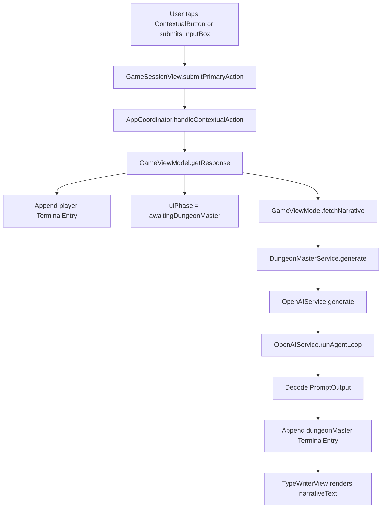
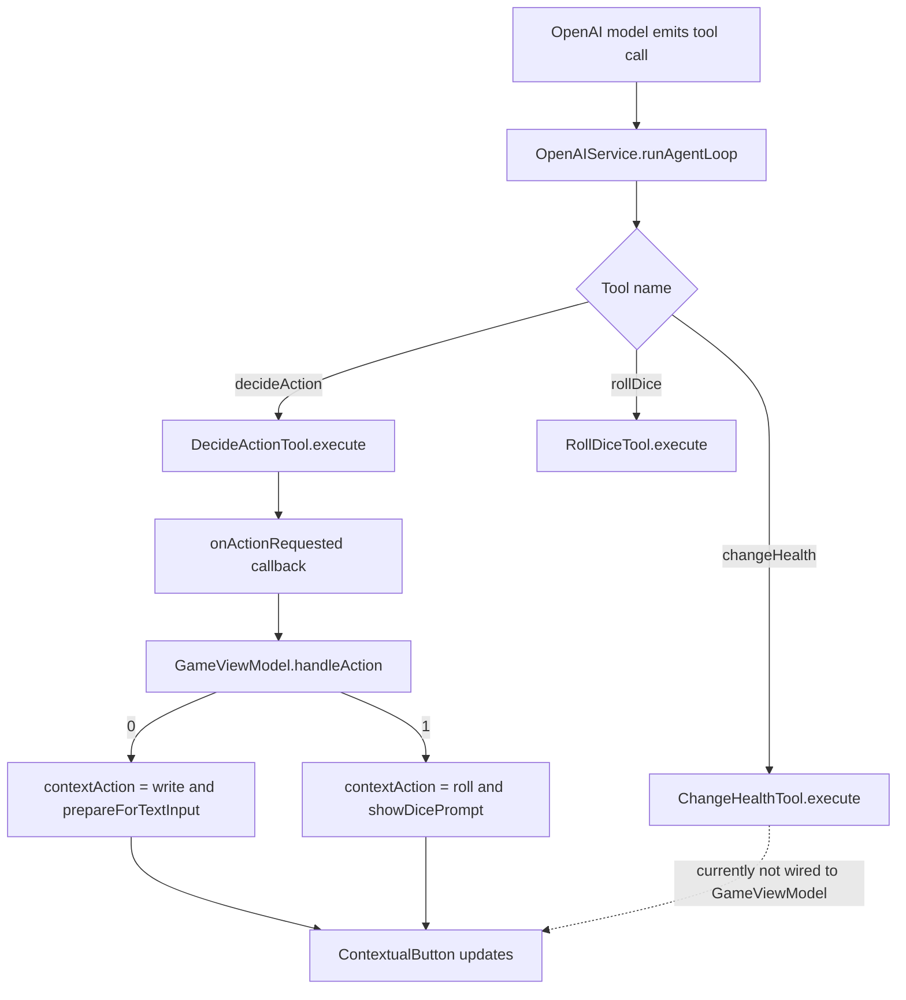
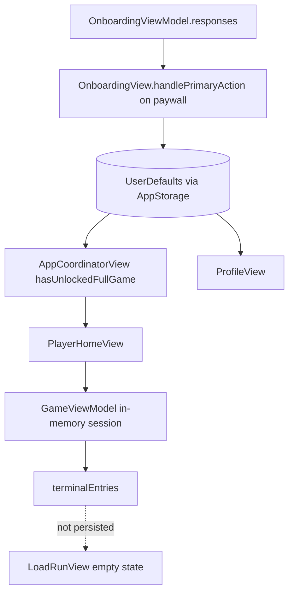
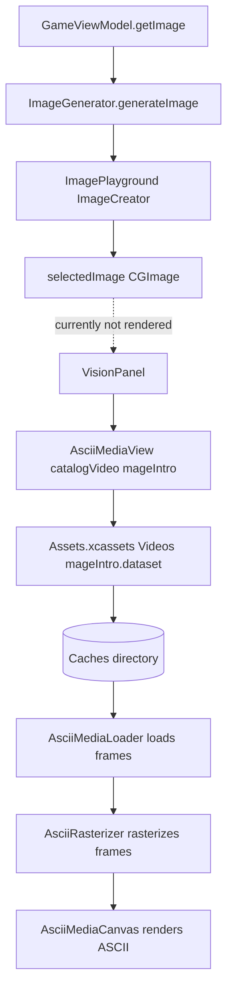

# Current AI Surface Map

Scope: current app at `/Users/enzoenrico/code/academy/published/magoSanduiche`.

This document maps the existing code surfaces that can support importing or reworking old-app AI prompting, AI provider connection, image generation, and AI-returned action-button behavior into the current `magoSanduiche` app. It is intentionally current-app focused.

## Project Summary

`magoSanduiche` is a native iOS SwiftUI app built from the Xcode project at `magoSanduiche.xcodeproj`.

- Framework/runtime: SwiftUI iOS app with the app entry point in `magoSanduiche/magoSanduicheApp.swift`.
- Navigation: `NavigationStack` with an observable `AppCoordinator`.
- State model: Swift Observation via `@Observable`, view-local `@State`, `@Environment(AppCoordinator.self)`, and `@AppStorage`.
- Package manager: Swift Package Manager through Xcode. There is no `package.json`, npm, or server package in this app.
- App target: bundle identifier `com.kyou.naninf`, marketing version `2.0`, Swift version `5.0`, app target deployment value `18.6` in `magoSanduiche.xcodeproj/project.pbxproj`.
- Build tooling: `buildServer.json` points to `xcode-build-server` for the `magoSanduiche` scheme.

Relevant dependencies and Apple frameworks:

- `OpenAI` Swift package from `https://github.com/MacPaw/OpenAI.git`, resolved to version `0.4.7` in `magoSanduiche.xcodeproj/project.xcworkspace/xcshareddata/swiftpm/Package.resolved`.
- `ImagePlayground` in `magoSanduiche/Services/ImageGeneration/ImageGenerator.swift`.
- `TipKit` in `magoSanduiche/Features/Game/GameView.swift` and `magoSanduiche/Features/Game/Tips/GameTips.swift`.
- `AVFoundation`, `ImageIO`, `CoreGraphics`, and `URLSession` inside `magoSanduiche/Shared/Views/AsciiMediaView.swift`.

High-level structure:

```text
magoSanduiche/
  App/
    RootView.swift
  Navigation/
    AppCoordinator.swift
    AppCoordinatorView.swift
    AppRoute.swift
  Features/
    Game/
      GameView.swift
      GameViewModel.swift
      Components/
      Subviews/
      Tips/
    Home/
    Onboarding/
    Profile/
  Models/
    Game/
  Resources/
    Prompts/
  Services/
    AI/
      OpenAIService.swift
      DungeonMasterService.swift
      StructuredOutput.swift
      Tools/
    ImageGeneration/
      ImageGenerator.swift
  Shared/
    Views/
  Public/
```

## Current Functionality Inventory

### AI Provider Connection

The current app already has an OpenAI client wrapper.

- `OpenAIService` in `magoSanduiche/Services/AI/OpenAIService.swift` owns the `OpenAI` client, stores `conversationHistory`, appends system instructions, runs chat completions, supports tools, and decodes structured JSON outputs.
- `DungeonMasterService` in `magoSanduiche/Services/AI/DungeonMasterService.swift` is the game-specific facade. It reads `OPENAI_API_KEY` from `Bundle.main.object(forInfoDictionaryKey:)`, initializes `OpenAIService` with `Prompts.systemPrompt`, and calls `generate(_:returning:tools:model:)` with `.gpt4_o_mini`.
- `Info.plist` contains an `OPENAI_API_KEY` entry. The value is intentionally not reproduced here. This is a risky integration point because a client-bundled API key can be extracted from the app.

There are no server-side API routes or server actions in the current app. Searches for web/server patterns show a native iOS app only; the only direct network code found is OpenAI package usage and `URLSession.shared.data(from:)` for remote media loading in `AsciiMediaView`.

### Prompting And Chat Loop

The interactive prompt flow exists and is centered in `GameViewModel`.

- `GameViewModel.getResponse(for:)` in `magoSanduiche/Features/Game/GameViewModel.swift` trims user input, rejects empty prompts, appends a `.player` `TerminalEntry`, clears the input, sets `uiPhase = .awaitingDungeonMaster`, then starts `fetchNarrative(for:)`.
- `GameViewModel.fetchNarrative(for:)` awaits `DungeonMasterService.generate`, appends the returned `PromptOutput.narrative` as a `.dungeonMaster` terminal entry, and moves the UI to `.result`.
- `PromptOutput` in `magoSanduiche/Resources/Prompts/PromptOutput.swift` defines the expected structured response: `narrative`, `toolResults`, and `options`. It includes a compatibility decoder for `toolResults` as either a string, array of strings, or array of `{ tool, result }` objects.
- `Prompts.systemPrompt` in `magoSanduiche/Resources/Prompts/Prompts.swift` is the active in-code system prompt. There is also `magoSanduiche/Public/Prompts/system_prompt.md`, which appears to be a prompt asset or earlier version and is not currently referenced by code.

Important current behavior:

- The UI currently renders only `result.narrative`. `PromptOutput.toolResults` and `PromptOutput.options` are decoded but not displayed or persisted.
- Conversation memory exists only inside `OpenAIService.conversationHistory` for the lifetime of the `DungeonMasterService` instance. There is no durable game-session transcript persistence yet.
- `DungeonMasterService.clearHistory()` exists but is not called by the current game lifecycle.

### AI Tools And Action Buttons

The current app has a tool-call model that already maps AI decisions into UI action changes.

- `ExecutableTool` in `magoSanduiche/Services/AI/OpenAIService.swift` defines the common static tool interface.
- `RollDiceTool` in `magoSanduiche/Services/AI/Tools/RollDice.swift` accepts `faces` and returns a random roll string.
- `DecideActionTool` in `magoSanduiche/Services/AI/Tools/DecideAction.swift` accepts `action: Int`, where `0` means text input and `1` means dice roll. It calls a static `onActionRequested` callback on the main actor.
- `ChangeHealthTool` in `magoSanduiche/Services/AI/Tools/ChangeHealth.swift` accepts `amount`, clamps it to `-40...40`, and calls a static `onHealthChange` callback on the main actor.
- `DungeonMasterService` passes `[RollDiceTool.self, DecideActionTool.self, ChangeHealthTool.self]` into OpenAI.
- `DungeonMasterService.init(actionCallback:)` wires only `DecideActionTool.onActionRequested`. `ChangeHealthTool.onHealthChange` is currently not connected to `GameViewModel.health`.

UI action surfaces:

- `GameAction` in `magoSanduiche/Models/Game/GameAction.swift` supports two UI actions: `.write` and `.roll`.
- `ContextualButton` in `magoSanduiche/Features/Game/Components/ContextualButton.swift` renders the current `GameAction`, loading state, button title, icon, and accessibility label.
- `GameView.submitPrimaryAction(vm:coordinator:)` branches on `vm.contextAction`; `.write` submits text through `vm.getResponse(for:)`, while `.roll` shows or resolves the dice prompt.
- `AppCoordinator.handleContextualAction(_:)`, `prepareForTextInput()`, `showDicePrompt()`, `finishDicePrompt()`, and `resetActionPresentation()` own the presentation toggles for input, dice, image collapse, and action-button visibility.
- `GameViewModel.handleAction(_:)` is the bridge from the AI `decideAction` tool into UI state. `0` sets `.write` and opens text input; `1` sets `.roll` and opens the dice prompt.

### Image And Media Handling

There are two separate current surfaces: generated images and ASCII media rendering.

Generated image surface:

- `ImageGenerator` in `magoSanduiche/Services/ImageGeneration/ImageGenerator.swift` wraps Apple `ImagePlayground`. It builds a text `ImagePlaygroundConcept`, optionally adds a reference `CGImage`, creates an `ImageCreator`, selects the first available style, and returns up to one generated `CGImage`.
- `GameViewModel` owns `imageGenService = ImageGenerator(concept: "An old wizard eating a sandwich")`, `selectedImage: CGImage?`, and `getImage()`.
- Search evidence shows `getImage()` and `selectedImage` are currently defined but not called or rendered by `GameView` or `VisionPanel`.

Media rendering surface:

- `VisionPanel` in `magoSanduiche/Features/Game/Subviews/VisionPanel.swift` currently renders `AsciiMediaView(catalogVideoNamed: "mageIntro")`, not the generated `selectedImage`.
- `HomeHeroBanner` also renders `AsciiMediaView(catalogVideoNamed: "mageIntro")`.
- `AsciiMediaView` in `magoSanduiche/Shared/Views/AsciiMediaView.swift` supports local images, remote images, local videos, remote videos, asset-catalog videos, and `UIImage`/`CGImage` sources. It rasterizes media to ASCII frames and plays videos unless reduce motion is enabled.
- `AsciiMediaView` caches catalog video bytes into the caches directory with `FileManager` before decoding frames.

### State Management

Current state is local, in-memory, and UI-centric.

- App-level navigation and presentation state live in `AppCoordinator`.
- Game session state lives in `GameViewModel`: `loading`, `selectedImage`, `contextAction`, `uiPhase`, `health`, `mana`, `diceValue`, `diceResultText`, `contextualInput`, and `terminalEntries`.
- `terminalEntries` starts with `Introduction.intro` from `magoSanduiche/Public/Introduction.swift`.
- UI phase is modeled by `GameUIPhase` in `magoSanduiche/Models/Game/GameUIPhase.swift`: `.reading`, `.ready`, `.composing`, `.awaitingDungeonMaster`, `.rollingDice`, and `.result`.
- Transcript entries are modeled by `TerminalEntry` and `TerminalEntryKind` in `magoSanduiche/Models/Game/TerminalEntry.swift`.

### Persistence And Storage

Persistence exists, but not for live AI sessions.

- `@AppStorage("hasUnlockedFullGame")` gates onboarding completion in `AppCoordinatorView` and `OnboardingView`.
- `@AppStorage("hasSeenGameTips")` suppresses repeated TipKit tips in `GameSessionView`.
- `OnboardingViewModel.persistResponsesOnUnlock(now:)` writes encoded `OnboardingResponses` and an `unlockDate` to `UserDefaults`.
- `ProfileView` reads `onboardingResponses`, `unlockDate`, `runsStarted`, `runsVictories`, `runsDefeats`, and `bestStreak` from `@AppStorage`.
- `LoadRunView` is currently an empty-state screen. It does not enumerate or load real saved runs.
- No SwiftData, Core Data, CloudKit, SQLite, Supabase, Firebase, or auth SDK usage was found in the current app.
- No Keychain storage was found.

### Auth, User Data, Purchases

There is no real auth layer in the current app.

- The user profile is local and derived from onboarding responses in `ProfileView`.
- The paywall screen in `OnboardingView` is placeholder UI. Search results include localized copy saying to connect StoreKit products before release, but there is no StoreKit implementation in Swift sources.
- `hasUnlockedFullGame` is a local `@AppStorage` flag, not an authenticated entitlement.

## Current Flow Diagrams

### User Input To AI Result



### AI Tool To UI Action Flow



### State And Persistence Flow



### Image And Media Flow



## Detailed Attachment Points

### Prompt And Provider Layer

- `magoSanduiche/Services/AI/OpenAIService.swift` / `OpenAIService`: best place to keep generic provider-client concerns, conversation history, structured output, and tool-loop mechanics.
- `magoSanduiche/Services/AI/DungeonMasterService.swift` / `DungeonMasterService`: best current seam for game-specific model choice, system prompt injection, tool registration, and future provider abstraction.
- `magoSanduiche/Resources/Prompts/Prompts.swift` / `Prompts.systemPrompt`: current active prompt. If old-app prompting is merged, update this or replace it with a loaded prompt asset, but avoid maintaining divergent prompt copies.
- `magoSanduiche/Public/Prompts/system_prompt.md`: currently appears unused. It should either become the canonical editable prompt source or be deleted/ignored after consolidation.
- `magoSanduiche/Resources/Prompts/PromptOutput.swift` / `PromptOutput`: best current structured response contract for narrative, options, and tool-result metadata. It should be extended only if the UI needs additional explicit fields, such as image prompt, button model, or state patch.

### Action Button And Game-State Layer

- `magoSanduiche/Models/Game/GameAction.swift` / `GameAction`: current action enum only supports `.write` and `.roll`. Old-app AI-returned action buttons should likely attach here by introducing a richer action model instead of creating parallel button concepts.
- `magoSanduiche/Features/Game/Components/ContextualButton.swift` / `ContextualButton`: current visual component for the primary action. Keep this as the rendering surface unless the old app has multiple simultaneous action buttons.
- `magoSanduiche/Features/Game/GameView.swift` / `submitPrimaryAction(vm:coordinator:)`: current dispatch point from UI taps into text submission or dice handling.
- `magoSanduiche/Features/Game/GameViewModel.swift` / `handleAction(_:)`: current bridge from AI action selection to UI presentation state.
- `magoSanduiche/Navigation/AppCoordinator.swift` / `prepareForTextInput()`, `showDicePrompt()`, `finishDicePrompt()`: current presentation toggles for action surfaces. Avoid duplicating these flags in views.
- `magoSanduiche/Services/AI/Tools/DecideAction.swift` / `DecideActionTool`: current AI-to-action callback model. It can be replaced by richer structured output or extended with typed action IDs, labels, and payloads.
- `magoSanduiche/Services/AI/Tools/ChangeHealth.swift` / `ChangeHealthTool`: exists but needs a callback connection before AI health changes affect UI.

### Image Layer

- `magoSanduiche/Services/ImageGeneration/ImageGenerator.swift` / `ImageGenerator`: current Apple image-generation wrapper. Use this for local/on-device image generation if the old app image feature can map to `ImagePlayground`.
- `magoSanduiche/Features/Game/GameViewModel.swift` / `selectedImage` and `getImage()`: current unrendered generated-image state. This is the most direct place to trigger generation from AI output and expose images to the view.
- `magoSanduiche/Features/Game/Subviews/VisionPanel.swift` / `VisionPanel`: current game visual panel. It should accept an optional generated image or media source rather than hard-coding only `mageIntro`.
- `magoSanduiche/Shared/Views/AsciiMediaView.swift` / `AsciiMediaView`: already supports `CGImage`, `UIImage`, remote image URLs, and videos. This should be reused for generated images rather than introducing another image renderer.

### Persistence Layer

- `magoSanduiche/Features/Home/LoadRunView.swift` / `LoadRunView`: current saved-run UX placeholder. It is the natural destination for durable session persistence.
- `magoSanduiche/Models/Game/TerminalEntry.swift` / `TerminalEntry`: current transcript unit. It is not `Codable` today because it contains a generated `UUID` and `TerminalEntryKind` is not `Codable`; both can be made persistable.
- `magoSanduiche/Features/Game/GameViewModel.swift` / game fields: `health`, `mana`, `terminalEntries`, `contextAction`, `uiPhase`, `diceResultText`, and eventually image references are the state to snapshot.
- `magoSanduiche/Features/Profile/ProfileView.swift`: current local counters are already keyed in `@AppStorage`; run counters can be incremented from game lifecycle events after persistence exists.

## Gaps And Constraints

What already exists:

- A working native game shell with onboarding, home, game, profile, and load routes.
- OpenAI chat integration through a Swift package.
- Conversation history in memory.
- Structured output decoding.
- Tool-call execution loop.
- AI-selected UI action type via `decideAction`.
- Local dice rolling and dice UI.
- Health and mana bars in UI state.
- Apple `ImagePlayground` wrapper.
- General ASCII media renderer that can render `CGImage`, `UIImage`, remote image URLs, and video frames.
- Local onboarding persistence through `UserDefaults` and `@AppStorage`.

What is missing or incomplete:

- No secure backend or proxy for OpenAI calls. The current API key is read from app bundle configuration.
- No provider abstraction beyond OpenAI.
- No server API routes or server actions, because this is a native iOS app.
- No auth, cloud user identity, entitlement validation, or real StoreKit implementation.
- No durable run/session persistence.
- `PromptOutput.options` and `toolResults` are decoded but not rendered.
- `ChangeHealthTool` is not wired to update `GameViewModel.health`.
- No mana tool exists even though the active prompt references mana management.
- Prompt/tool names are inconsistent: active prompt mentions `playerMana`, `playerDamage`, `decide`, and `rollDice`; `Public/Prompts/system_prompt.md` mentions `roll_dice`; implemented tools are `rollDice`, `decideAction`, and `changeHealth`.
- `ImageGenerator` is present but not used by the visible `VisionPanel`.
- Generated images are stored as `CGImage?` in memory only and are not persisted or associated with turns.
- The AI-returned action model is currently an integer side effect from a tool call, not a durable typed action response.

Risky integration points:

- Client-bundled OpenAI API key in `Info.plist`. Any implementation plan should move provider secrets behind a backend, local development config, or another secure boundary before release.
- Static callbacks on tool structs: `DecideActionTool.onActionRequested` and `ChangeHealthTool.onHealthChange` are global mutable state. This can behave poorly with multiple sessions, previews, tests, or overlapping requests.
- `OpenAIService` is `@MainActor`, so long tool loops and client calls are invoked from a main-actor object. The underlying async calls yield, but UI-coupled service ownership should be reviewed before adding heavier work.
- `OpenAIService.runAgentLoop` allows up to 20 tool iterations; richer tools should guard against repeated UI side effects.
- `PromptOutput` currently gives schema instructions manually while also using `responseFormat: .jsonObject`; this is pragmatic but not a strict JSON schema enforcement path.
- `GameViewModel.rollDice()` currently resolves local game consequences independently of AI. If the old app expects AI-mediated dice outcomes, this flow needs a clear handoff contract.
- `AsciiMediaView` can load remote media via `URLSession`; remote URLs from AI should be validated before loading.
- `ImagePlayground` availability and policy constraints may differ by device and OS; `ImageGenerator` currently swallows errors and returns `nil`.

## Recommendations For Implementation Planning

1. Consolidate the prompt contract first.
   - Make `Prompts.systemPrompt` and `PromptOutput` the canonical contract, or load the markdown prompt asset from `Public/Prompts/system_prompt.md`.
   - Align prompt tool names with implemented tools: `rollDice`, `decideAction`, and `changeHealth`, or rename tools to match the desired old-app contract.
   - Add explicit structured fields for action-button descriptors and optional image prompts only if the old app requires more than the current `options` array.

2. Replace integer action side effects with a typed action model.
   - Extend `GameAction` or introduce a `GameActionDescriptor` that can represent text input, dice roll, generated option buttons, labels, and payloads.
   - Render through `ContextualButton` for one primary action, or introduce an adjacent options stack if old-app AI returns multiple buttons.
   - Keep `AppCoordinator` as the owner of presentation visibility so input, dice, and image panel state stay centralized.

3. Wire game-state tools deliberately.
   - Connect `ChangeHealthTool.onHealthChange` to `GameViewModel.health`, with clamping to `0...maxHealth`.
   - Add a mana tool if the prompt expects AI-managed mana.
   - Decide whether dice rolls are AI tool results, user-driven UI events, or both. Avoid double-rolling between `RollDiceTool` and `GameViewModel.rollDice()`.

4. Attach image generation to turn results.
   - Add an image prompt field to `PromptOutput` or derive one from narrative after each turn.
   - Trigger `GameViewModel.getImage()` or a new async image method after narrative generation.
   - Pass `selectedImage` into `VisionPanel` and render it with `AsciiMediaView(image:)`, falling back to `mageIntro`.
   - Persist generated images as files or regenerate from saved prompts; do not persist raw `CGImage` in `UserDefaults`.

5. Add durable session persistence before implementing real load-run UX.
   - Create Codable game-session models separate from view models.
   - Persist transcript entries, health, mana, current action descriptor, image prompt/media reference, and OpenAI conversation replay data.
   - Make `LoadRunView` list saved sessions instead of showing only the current empty state.

6. Move provider secrets out of the client before shipping.
   - For production, route OpenAI calls through a backend or provider gateway that owns the secret.
   - Keep the current `DungeonMasterService` interface as the app-side facade so UI code does not depend on transport details.

## Suggested Attachment Order

Lowest-risk implementation order:

1. Prompt/schema cleanup in `Prompts`, `PromptOutput`, and tool definitions.
2. Game-state tool wiring for `ChangeHealthTool` and any mana equivalent.
3. Typed action descriptor model and `ContextualButton`/options rendering.
4. Image prompt field plus `VisionPanel` rendering of `selectedImage` via `AsciiMediaView`.
5. Codable session snapshot models and `LoadRunView` persistence.
6. Provider-secret hardening through a backend/proxy or other secure boundary.

This order builds on current code instead of duplicating it: `OpenAIService` remains the provider loop, `DungeonMasterService` remains the domain facade, `GameViewModel` remains the game-session state owner, `AppCoordinator` remains the presentation coordinator, `ContextualButton` remains the primary action surface, and `AsciiMediaView` remains the media renderer.
