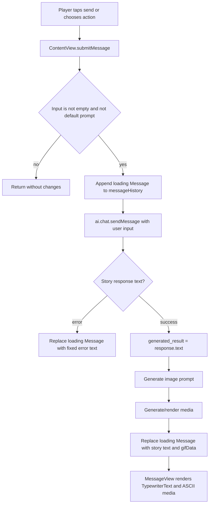
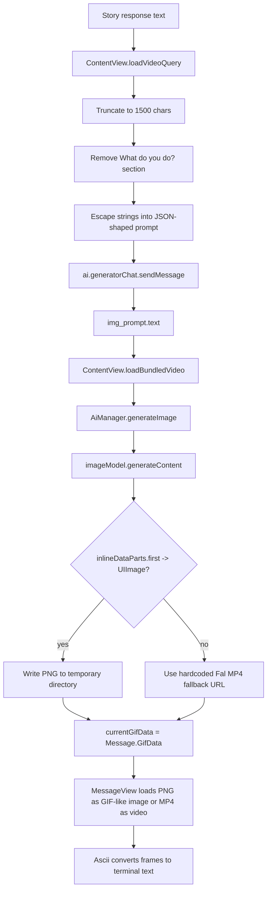
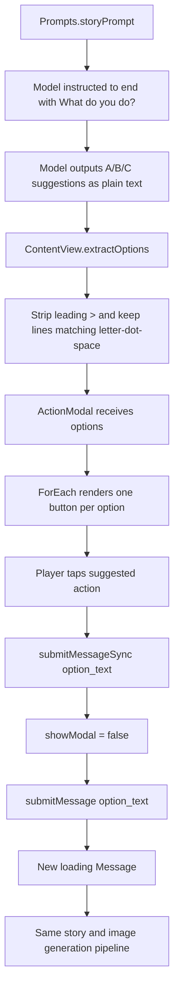
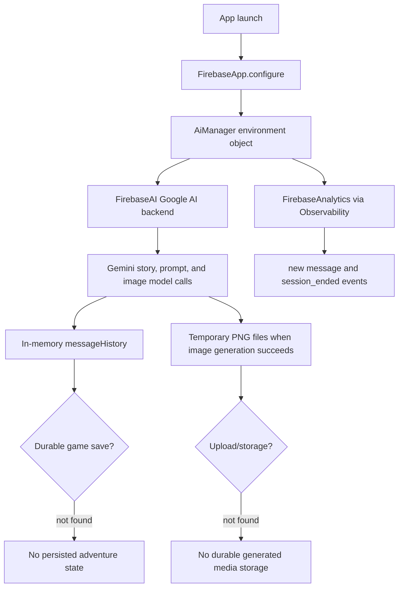

# Old App AI Functionality Map

This document maps the AI-related behavior in the old app found at `/Users/enzoenrico/code/academy/published/magoSanduicheOld`. The path requested as `/Users/enzoenrico/code/academy/magoSanduicheOld` was checked and does not exist; the old app does exist as `../magoSanduicheOld` relative to the current app at `/Users/enzoenrico/code/academy/published/magoSanduiche`.

The old app target is named `smorki`. The core AI implementation lives in:

- `smorki/Services/AiManager.swift`
- `smorki/Models/Prompts.swift`
- `smorki/ContentView.swift`
- `smorki/Components/ActionModal.swift`
- `smorki/Components/MessageView.swift`
- `smorki/Services/Ascii.swift`

## High-Level Inventory

### AI Provider And Client Connection

- `smorki/Services/AiManager.swift` imports `FirebaseAI`, `Firebase`, `FalClient`, `Foundation`, and `SwiftUI`.
- `AiManager` creates a Firebase AI client with `FirebaseAI.firebaseAI(backend: .googleAI())`.
- `smorki/smorkiApp.swift` calls `FirebaseApp.configure()` in `smorkiApp.init()`, then injects one `AiManager` instance into SwiftUI with `.environmentObject(firebase)`.
- Firebase configuration is bundled in `smorki/GoogleService-Info.plist`. It includes a Firebase/Google API key and app identifiers. The key value should not be copied into new docs, logs, or code comments.
- `FalClient` is imported and linked, but no active Fal generation call was found. The old app has leftover Fal-facing code: `Models` contains Fal model IDs, and `AiManager` contains `Payload` helper methods, but neither is used by the current runtime flow.

### Model And Provider Choices

- Story model: `gemini-2.5-flash`, configured in `AiManager.init()` with `Prompts.storyPrompt` as `systemInstruction`.
- Prompt-generator model: `gemini-2.5-flash-lite`, configured in `AiManager.init()` with `Prompts.imagePrompt` as `systemInstruction`.
- Image model: `gemini-2.0-flash-preview-image-generation`, configured in `AiManager.init()` with `GenerationConfig(responseModalities: [.text, .image])`.
- Dormant video model choices are declared in `smorki/Models/Models.swift`:
  - `fal-ai/wan/v2.2-a14b/text-to-video/turbo`
  - `fal-ai/wan-t2v`
  - `fal-ai/ltx-video-13b-distilled`
- `Prompts.negativePrompt` exists and is assigned to `AiManager.negativeVideoPrompt`, but no call uses it.

### Prompting

- `Prompts.storyPrompt` is the main system prompt. It tells the model to act as an expert solo Dungeon Master, refer to the player as "the mage", preserve memory through chat history, narrate in paragraphs prefixed with `>`, end with `What do you do?`, and provide three lettered action suggestions such as `A.`, `B.`, and `C.`.
- `Prompts.imagePrompt` is the second system prompt. It asks a model to transform `{ "system_response": ..., "user_input": ... }` into a JSON-shaped image description with fields like `subject`, `context`, `action`, `style`, `cameraMotion`, `composition`, and `ambiance`.
- `Prompts.negativePrompt` is a JSON-shaped negative prompt for image/video quality issues, but it is currently unused.
- `smorki/Assets/query.json` contains an older or alternate video-prompt template with `continuousVideoPrompts` and `continuousVideoPrompts_Negative`; no code reference to this asset was found.

### Text Generation Behavior

- `ContentView.submitMessage(_:)` is the primary text runtime.
- It trims `userInput`, ignores empty/default input, appends a loading `Message`, resets `userInput` to `"> "`, then sends the player input to `ai.chat.sendMessage`.
- `ai.chat` is a lazy `Chat` created from the story model via `model.startChat(history: history)`.
- The response is read with `.text`, making the behavior non-streaming.
- On success, the model text is stored as `generated_result`, printed in debug output, and later written into `messageHistory`.
- On story generation failure, the loading message is replaced by a completed error message: `Error: Could not generate story. Please try again.`

### Image Generation Logic

- After story text succeeds, `ContentView.submitMessage(_:)` calls `loadVideoQuery(generated_result:trimmedInput:)`.
- `loadVideoQuery` truncates the story response to 1500 characters, removes the section starting at `What do you do?`, manually escapes the story and user input for a string-interpolated JSON payload, and sends it to `ai.generatorChat.sendMessage`.
- The prompt-generator response is force-unwrapped as `img_prompt.text!` and passed to `loadBundledVideo(prompt:)`.
- `loadBundledVideo(prompt:)` calls `ai.generateImage(prompt)`.
- `AiManager.generateImage(_:)` calls `imageModel.generateContent(prompt)`, takes `inlineDataParts.first`, creates a `UIImage`, and returns it.
- The generated `UIImage` is written as a PNG to `FileManager.default.temporaryDirectory` using a UUID filename.
- Despite the method names (`loadBundledVideo`, `videoURL`, `GifData`), the active Gemini image path generates still images, not video.
- If image generation returns `nil`, the old app falls back to a hardcoded Fal-hosted MP4 URL: `https://v3.fal.media/files/panda/GlYLge7xLsr9K39M33kG3_output.mp4`.
- There is no upload to durable storage. Generated images live only in the device temporary directory.

### Media Rendering

- `Message.GifData` in `smorki/Components/MessageView.swift` stores a `url`, `frameCount`, and `aspectRatio`.
- `ContentView.loadBundledVideo(prompt:)` stores the generated temporary PNG URL or fallback MP4 URL in `currentGifData`.
- `MessageView` renders message text with `TypewriterText`.
- If `message.gifData` exists, `MessageView` creates an `Ascii` instance and renders `ascii.currentFrame` as terminal-style text.
- `MessageView` checks the file extension:
  - `.mp4` calls `ascii.loadVideo(url:)`.
  - Any other extension calls `ascii.loadGIF(from:)`. This likely handles generated PNGs through `CGImageSource`, even though the method name says GIF.
- `Ascii` converts image/video frames into text with the character ramp `"  .*░▒▓█"`, luminance sampling, gamma correction, and a timer-driven playback loop.

### Suggested Actions As UI Buttons

- The action suggestions are not returned as a schema. They are plain text produced by the story model because `Prompts.storyPrompt` tells the model to include `What do you do?` followed by lettered suggestions.
- `ContentView.extractOptions(from:)` finds the first `What do you do?` marker, takes the response tail, splits on newlines, strips a leading `>` with regex, and keeps lines matching `^[A-Z]\.\s`.
- The extracted strings are passed into `ActionModal(options:)` from `ContentView.body`.
- `ActionModal` renders each option with `ForEach(options, id: \.self)`.
- For display, `ActionModal` separates the leading `A.`, `B.`, or `C.` from the option body using regex `^[A-C]\.`.
- Each suggested-action button calls `submitMessageSync(option_text)`.
- `submitMessageSync(_:)` closes the modal and starts a `Task` that calls `submitMessage(val)`, feeding the selected option back into the same story/image pipeline as typed input.

### State Management

- `AiManager` is an `ObservableObject` injected as an environment object.
- `ContentView` owns local UI/session state:
  - `messageHistory: [Message]`
  - `currentGifData: Message.GifData?`
  - `userInput`
  - modal flags like `showModal` and `showResetModal`
  - intro/reset flags like `showStartAnimation`, `uiOpacity`, and `isGameEnded`
- `AiManager.history` is a published array initialized with `[ModelContent()]`, and `ai.history.append(contentsOf:)` is called after each completed message.
- The active `Chat` is created lazily with `model.startChat(history: history)`. After creation, appending to `AiManager.history` does not recreate the chat; Firebase's `Chat` object is expected to manage the live exchange history internally.
- Resetting the adventure clears only `messageHistory` and UI flags; it does not reset `ai.chat`, `ai.generatorChat`, or `AiManager.history`.

### Persistence And Backend Flow

- No app data persistence was found for the game state. Searches found no `UserDefaults`, `@AppStorage`, `SwiftData`, `CoreData`, `Firestore`, or local document storage for messages.
- The only local file write in Swift code is the temporary PNG write in `ContentView.loadBundledVideo(prompt:)`.
- Firebase is used for:
  - AI calls via Firebase AI with Google AI backend.
  - Analytics via `Observability`.
- `Observability.logEvent(_:)` wraps `Analytics.logEvent`.
- `ContentView` logs `new message` when `messageHistory.count` changes and logs `session_ended` on disappear with `message_history` in the analytics parameters.
- There are no API routes, server actions, or app-owned backend endpoints in this SwiftUI app.

### Streaming And Non-Streaming Behavior

- All AI calls are non-streaming.
- Text story generation uses `sendMessage`.
- Prompt generation uses `sendMessage`.
- Image generation uses `generateContent`.
- Searches for `sendMessageStream`, `generateContentStream`, `AsyncThrowingStream`, `for await`, and `stream` found no active streaming implementation.

### Error Handling

- Story generation errors are caught in `ContentView.submitMessage(_:)` and surfaced to the UI as a fixed error response.
- Image generation errors are caught in `AiManager.generateImage(_:)`, printed, and converted to `nil`.
- If image generation returns `nil`, `ContentView.loadBundledVideo(prompt:)` falls back to a hardcoded remote MP4.
- If prompt generation fails in `submitMessage(_:)`, the code prints `no image prompt generated` and returns. This leaves the previously inserted loading message unresolved.
- `img_prompt.text!` is force-unwrapped, so a prompt-generator response without text can crash.
- Temporary file writes use `try?`, so image persistence failures are silently ignored.
- `Ascii` logs frame/media failures with `print` and often falls back to empty frames or a loading string.

## Runtime Flow Diagrams

### Text Prompt To AI Response To UI

Key code references:

- `ContentView.submitMessage(_:)` in `smorki/ContentView.swift`
- `AiManager.chat` in `smorki/Services/AiManager.swift`
- `MessageView` and `TypewriterText` in `smorki/Components/MessageView.swift`

### Image Generation Flow

Key code references:

- `ContentView.loadVideoQuery(generated_result:trimmedInput:)` in `smorki/ContentView.swift`
- `ContentView.loadBundledVideo(prompt:)` in `smorki/ContentView.swift`
- `AiManager.generateImage(_:)` in `smorki/Services/AiManager.swift`
- `Ascii.loadGIF(from:)`, `Ascii.loadVideo(url:)`, and `Ascii.convertImageToASCII(cgImage:)` in `smorki/Services/Ascii.swift`

### AI Actions To UI Buttons To State Changes

Key code references:

- `Prompts.storyPrompt` in `smorki/Models/Prompts.swift`
- `extractOptions(from:)` in `smorki/ContentView.swift`
- `ActionModal` in `smorki/Components/ActionModal.swift`
- `ContentView.submitMessageSync(_:)` in `smorki/ContentView.swift`

### Persistence, Analytics, And Backend Boundaries

Key code references:

- `smorkiApp.init()` in `smorki/smorkiApp.swift`
- `AiManager` in `smorki/Services/AiManager.swift`
- `Observability` in `smorki/Services/Observability.swift`
- `ContentView.messageHistory` and `ContentView.loadBundledVideo(prompt:)` in `smorki/ContentView.swift`

## Detailed File And Symbol Notes

### `smorki/Services/AiManager.swift`

`AiManager` is the old app's provider adapter and model registry.

- `negativeVideoPrompt`, `systemPrompt`, and `generatorPrompt` load raw strings from `Prompts`.
- `fAI` uses Firebase AI with `.googleAI()`.
- `model` is the story model.
- `generatorModel` converts story context and user input into an image prompt.
- `imageModel` generates inline image data.
- `history` is published but only used at chat creation and manually appended to later.
- `generatedVideoURL` and `isGeneratingVideo` are published but unused by the inspected Swift code.
- `chat` and `generatorChat` are lazy `Chat` instances.
- `generateImage(_:)` is the only active image generation call.
- `extractString(from:)` and `extractInt(from:)` are private helpers for `Payload`, likely leftover from Fal client work; no usages were found.

### `smorki/Models/Prompts.swift`

`Prompts` holds every active prompt template found in code.

- `imagePrompt` is a system instruction for the prompt-generator model, not for the final image model.
- `storyPrompt` is the main product behavior contract. It defines the D&D narrator voice, response formatting, memory expectation, danger level, and suggested-action format.
- `negativePrompt` is present but not wired to any generation call.

There is no separate typed prompt builder, localization layer, or prompt versioning mechanism.

### `smorki/ContentView.swift`

`ContentView` is both UI controller and orchestration layer.

- `startScreen()` injects the initial welcome message with a bundled `opening.mp4` URL if present.
- `submitMessage(_:)` drives story generation, prompt generation, image generation, message replacement, and AI history appending.
- `loadVideoQuery(generated_result:trimmedInput:)` builds the second model call by hand with string escaping.
- `loadBundledVideo(prompt:)` turns the image model result into a temporary PNG URL or fallback MP4 URL, then stores `currentGifData`.
- `extractOptions(from:)` is the action parser.
- `resetAdventure()` clears visible messages and restarts the start screen, but does not reset the AI chat session.

### `smorki/Components/ActionModal.swift`

`ActionModal` is the UI bridge from model text to tappable actions.

- It shows a `TextEditor` for custom input.
- It renders `send` and `go back` buttons.
- It optionally shows model-suggested actions under an `or` separator.
- For each option, it extracts a letter label from `^[A-C]\.` and strips that label from the submitted text.
- Suggested buttons submit only the option body, not the original `A.`/`B.`/`C.` marker.

### `smorki/Components/MessageView.swift`

`MessageView` defines the session message model and rendering.

- `Message` is a local `Identifiable` struct, not `Codable`.
- `Message.GifData` holds a media URL plus frame metadata.
- Loading messages show `Generating story` with a simple animated character sequence.
- Completed responses are animated with `TypewriterText`.
- Media is rendered as ASCII text by a per-message `Ascii` object.

### `smorki/Services/Ascii.swift`

`Ascii` is the media conversion engine.

- GIFs/images are loaded through `CGImageSource`.
- MP4 videos are loaded through `AVAsset`.
- Video frames are precomputed with `AVAssetImageGenerator`.
- Frames are converted to grayscale, mapped through a small character set, and rendered as a string.
- Playback is timer-driven with `frameRate = 0.08`.

## Request And Response Types

There are no custom request/response DTOs for AI calls.

- Story request: a Firebase AI `ModelContent` part with role `user` and the raw trimmed player input.
- Story response: `GenerateContentResponse.text` read from `ai.chat.sendMessage(...).text`.
- Prompt-generator request: a manually escaped JSON-shaped string containing `system_response` and `user_input`.
- Prompt-generator response: `GenerateContentResponse.text`, force-unwrapped before image generation.
- Image request: the prompt-generator text passed directly as a raw `String` to `imageModel.generateContent`.
- Image response: first inline data part from `GenerateContentResponse.inlineDataParts`.
- UI message response: local `Message(title:response:gifData:)`.
- Suggested actions: parsed strings, not typed objects.

## Schema Parsing And Validation

No active schema parsing or validation was found.

- The prompt text asks for JSON-like output, but the code does not parse it with `JSONDecoder`, `JSONSerialization`, `Codable`, or a Firebase response schema.
- The story action suggestions are parsed with string operations and regular expressions.
- `loadVideoQuery` manually escapes JSON string values instead of using `JSONEncoder`.
- If the prompt-generator model returns malformed JSON-like text, the app still passes that text to the image model.

Search evidence:

- Searches for `JSONDecoder`, `JSONSerialization`, `Decodable`, `Codable`, `Schema`, `responseSchema`, `functionCalling`, and `FunctionDeclaration` found no matches in the old app.
- Searches for `extractOptions` and action-related code found the active parser in `smorki/ContentView.swift`.

## Dependencies And Configuration

Swift package references in `smorki.xcodeproj/project.pbxproj` and `Package.resolved` include:

- Firebase iOS SDK `12.0.0`
- `FirebaseAI`
- `FirebaseAnalytics`
- `fal-swift` `0.5.6`
- Transitive Firebase/Google dependencies such as `GoogleAppMeasurement`, `GoogleUtilities`, `gRPC`, `abseil`, `nanopb`, and `swift-protobuf`

Runtime configuration:

- `smorki/GoogleService-Info.plist` provides Firebase configuration, including an API key.
- `smorki/Info.plist` declares the custom `DepartureMono-Regular.otf` font.
- No `.env`, server-side key exchange, or app-owned API route was found.

## Security And Reliability Concerns

- The Firebase/Google API key is bundled in the app through `GoogleService-Info.plist`. That is normal for Firebase client apps, but it should be restricted in Google Cloud/Firebase settings and never treated as a server secret.
- The app calls Gemini directly from the client through Firebase AI. There is no server-side policy layer, rate limiter, moderation layer, or audit point in the inspected code.
- `ContentView` sends `message_history` to Firebase Analytics on disappear. The value is an array of local `Message` structs and may contain user-generated adventure text. This is risky for privacy and may not be accepted as a valid Analytics parameter type.
- `img_prompt.text!` can crash if the prompt-generator response has no text.
- If `loadVideoQuery` fails after a story response succeeds, the loading message can remain stuck.
- Resetting the adventure does not reset the active AI chat, so a new visible session may still inherit old model context.
- The story prompt asks the model to provide three options, but the UI trusts formatting. If the model omits `What do you do?` or formats options differently, no suggested buttons appear.
- Manual JSON escaping in `loadVideoQuery` is fragile compared with `JSONEncoder`.
- Temporary PNG writes use `try?`, hiding file-system errors.
- The image generation path names still say "video" and "gif", which makes maintenance confusing.
- `FalClient`, `Models`, `negativeVideoPrompt`, `generatedVideoURL`, `isGeneratingVideo`, `selectedGIFURL`, `lastFrame`, and `loadBundledGIF(path:)` appear unused or leftover.

## Features Not Found

- No streaming text or image generation.
- No typed structured output schema.
- No function/tool calling.
- No JSON validation of AI output.
- No backend API routes or server actions.
- No durable persistence for adventures.
- No upload/storage pipeline for generated images.
- No active Fal text-to-video generation despite package/model remnants.
- No use of `smorki/Assets/query.json` from Swift code.

## Portable Implementation Ideas For The New App

- Keep the split between story generation and visual prompt generation. The old app's two-step approach is reusable: first generate narrative, then distill the visible moment into an image prompt.
- Preserve the strong story prompt requirements, especially a consistent player identity, persistent-world framing, sensory narration, and explicit action suggestions.
- Replace plain-text action extraction with structured output, for example `{ narrative, actions: [{ id, label, prompt }] }`, so UI buttons do not depend on `What do you do?` formatting.
- Use `JSONEncoder` or typed structured output for the image prompt request instead of manual escaping.
- Keep generated actions as first-class app state, not text parsed from the narrative body.
- Reset AI chat/session state when the player resets the adventure.
- Treat image generation as image generation in naming and types. Avoid `video`/`gif` naming unless the app is truly generating those media types.
- Store generated image metadata separately from message text so the UI can retry, cache, or drop media independently.
- Add a clear failure state for each stage: story generation, visual prompt generation, image generation, and ASCII rendering.
- Consider moving AI calls behind a service boundary if the new app needs quotas, abuse controls, model swapping, logging, or key restrictions.
- Keep the ASCII renderer idea: it is a distinctive UI affordance and can be reused with clearer media abstractions.
